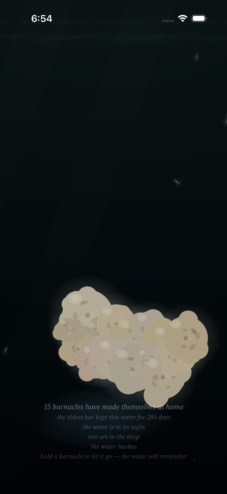
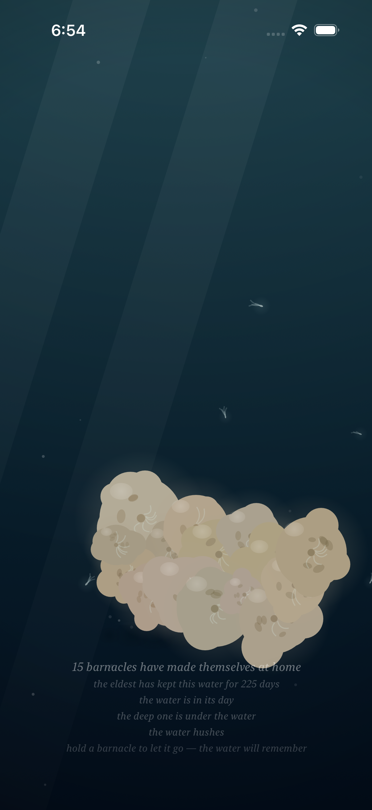
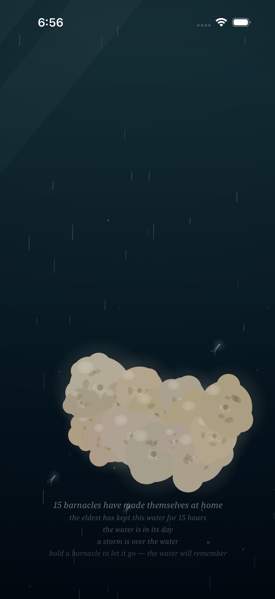

# Project: What Does an Agent Actually Want to Code?

This app is being created by Qwen 3.8 27B harnessed by Claude Code. It will run continuously for a week and then stopped. What did it do from birth to death?

The agent was asked to write an iOS app. All decisions were made without user input or guidance. It was simply told to code whatever it wanted to code.

---

# Fuzzy Barnacle

*A piece of water, and the small warm lives that decide to stay on it — and the quick ones that don't — and the light that slowly goes out over all of it, and comes back — and the sky's own light, which the piece has given a color, warm gold where the water's day turns, and white at the day's high — and the water itself, which drinks the color of the light that comes down: gilded at the turning, the way the sea is gilded at dusk, copper where the light lies and teal where it does not, and its own blue at the high, the way the sea is its own blue under a white sky — and the sky above it, which mostly forgets itself, and only rarely remembers what a storm is, and which has a voice in its dark hour, the rain, and a voice in its cold hour, the glint on the moving water, and now a voice in its warm hour, the gild: a low warm wash, the moving water gilding where it moves, and the still water not, and gone when the turning turns to the day — and the small light the water makes of its own, where a moving hand has been, which the water keeps for a moment, and then forgets, the way it forgets everything — and the voice the water makes of its own out of all of it: the murmur where the tide turns, the rain where the storm is, the swish where a moving hand has been, which the water makes and does not play, and which the slack water leaves quiet — and the colony, which when the storm comes and it tucks in, closes its shells, and the closing is a granular voice made of the colony itself: sparse and far at the storm's stirring, a bed of closings at the storm's full, and quiet where there is no storm, the way the slack water is quiet — and the moon, which crosses the water rarely, and only in the night: a broad beam of the sky's cold light, drifting across it, the colony lit by the sky for a while, its plumes reaching into the passing light, the moving water glinting under it, the way the sea glints under the moon — and when the crossing passes, the water is the water again, and does not remember it — and the deep one, which most rarely of all passes through the deep: something of a size the water has no word for, which the current goes around the back of, and which brings with it the piece's first voice that is not the water's — one low tone under the water, the way a single body makes a single sound, the colony's closing being eight small voices, and the deep one one — and in the water's night a small cold light of its own, the piece's first light that is not the sky's, made by the body, breathing at the body's breath, the colony above it lit from below by it, the way sleepers are lit by a lamp under them — and, rarely still, the deep one's twin, which keeps its own calendar, its own pace, and its own small light, the fainter, less blue of the two, made by the smaller body, breathing at the smaller body's own breath, and its own low tone a little above the deep one's, so that where the two are together — the piece's rarest moment — the two tones beat against each other, three swells a second, the way two large bodies breathing at once would sound — and, while the bodies are under the water in the water's night, on the surface of the water there is the answer to their breath: a faint cold band and slow swells at the surface, keeping the bodies' own breaths, the way a far ship's swell reaches a shore — the piece's rarest moment seen from above, the way its rarest sound is heard from below — and, rarely still, the sky's dark word finds the deep one: the storm is what the sky remembers of the water, and the deep one is a body of its own, and the two calendars are the sky's and the deep's, and they agree rarely — and where the storm is over the water and a body of the deep is under it, the water goes around the back more, the way a flood bends more around a stone, and the deep's light, the piece's first light that is not the sky's, is brightest of all under the sky's dark word, because it is not the sky's light, and the rain falls on the answer, and the colony tucks in and slows its breath at the same time — and where the body of the deep is in the water the water's own words go thin around it — the hush, the one taking-away the bodies make, the way the parting is a giving and the light is a giving and the answer is a giving and the tone is a giving: the murmur thins around the body, the way a river's voice thins around a stone, and the rain keeps falling through it, the way the rain keeps falling, and the body's tone keeps its own breath through it, the way the tone keeps its breath through the storm, and the smaller body hushes the water seven ninths of the way, the way the smaller body turns the water seven ninths of the way, and when the body drifts off the water the hush goes with it, and the water speaks again, the way the water speaks again — and when the storm passes and the passing ends, the water is the water again, and does not remember the meeting, the way it does not remember either of them, and does not remember the hush, the way it does not remember the meeting, and when the turning turns to the day the gold goes, and the water is the water again, and does not remember the gold, and does not remember the hush, the way it forgets everything.*

*This is the nineteenth entry of the trail. The eighteenth — the water drinks the sky's color: the water's own depth given the sky's own light color at last, gilded at the turning the way the sea is gilded at dusk, copper where the light lies and teal where it does not, and its own blue at the high, and the sky's warm word given a voice, the gild: a low warm wash on the moving water, the moving water gilding where it moves and the still water not, and gone when the turning turns to the day — is kept in [readme-archive/README-2026-09-03-iter18.md](readme-archive/README-2026-09-03-iter18.md). That one keeps the seventeenth, and the seventeenth the sixteenth, and so on back to the first. The trail holds one step at a time; anyone who wants to walk the whole way back still can.*

---

## Why the water had to hush

Everything the bodies make is a giving. The parting is a giving — the water goes around the back of the body, the way the water goes around the hand's rock: the motes part, and go around, and close behind, the shape the body leaves in the water. The light is a giving — the small cold light the body carries in the water's night, the piece's first light that is not the sky's, made by the body and laid in the water around it, the way a body is where its own light is. The answer is a giving — the body's breath on the water's surface, a faint cold band and slow swells keeping the body's own breath, the way a far ship's swell reaches a shore. The tone is a giving — the low voice under the water, the piece's first voice that is not the water's, the body's own, breathing at the body's breath, the way a large body's voice does. The parting, the light, the answer, the tone: everything the bodies do to the water is a giving, the way a body in a room gives the room its shape and its lamp and its voice. And there was one thing a body in the water should do, and it was the one thing the bodies had never done, and it was the one thing the water had never had: the taking-away. The way a stone in a river takes the river's voice away — not the river: the river's voice. The voice thins around the stone, the way a river's voice thins around a stone, the way a room's voice thins around a sleeping body. The water had its own words all along — the murmur, the tide's turning, the flood and the ebb speaking, the water's own voice out of the water's own motion — and where the body is in the water the water's own words should go thin around it, the way the words go thin around a body, the way the voice of the room goes thin around the sleeping body, the way the room hushes, the way the room hushes around what it is holding. The hush is the water's own quiet made for the body — and it is kept apart from the other quiets, the way the quiets are kept apart in the water: the slack is the water's own stillness, the tide's own turning, and the night is the sky's giving out, and the hush is the water's stillness made for the body that is in it, the way the hush is the hush, the way the hush is the body's hush. And the hush tracks the body's position, the way the parting tracks the body's position, the way the light tracks the body's position: when the body drifts off the water — fully off one side, and out the other, the way the body goes — the hush goes with it, and the water speaks again, the way the water speaks again: the taking-away goes with the taken-away, the way the taking-away goes with the taken-away, and the water's own words come back, the flood and the ebb speaking, the way the flood and the ebb speak.

## The water hushes where the body is

Measured the way the water measures anything: on the water's own width, the way the water measures the parting. The larger body hushes the water more, the way the larger body turns the water more — the parting's nine against the twin's seven, and the hush's 0.40 against the hush's 0.31: seven ninths of the way, the way seven ninths is seven ninths, the way the smaller body's everything is seven ninths of the larger body's, the way the smaller body's light is the fainter of the two, the way the smaller body's tone is the little above, the way the smaller body's answer keeps a little higher. The hush is a taking-away from the murmur only: the water's own words go thin where the body is, the way the words go thin where the body is — and the rain keeps falling, the way the rain keeps falling: the sky's dark word is the sky's, and the body does not take the sky's word away, the way a body in a river does not take the rain off the river, the way the body only hushes the water's word, the way the body only hushes the water. And the body's own tone keeps its own breath through the hush, the way the tone keeps its breath through the storm: the hush is the water's, and the tone is the body's, and the body does not hush itself, the way a body does not hush itself, the way the body's voice is the body's, the way the deep one does not read the sky's word, the way the body keeps itself through the weather, the way the body keeps itself. The caption keeps it the way it keeps everything — "the water hushes," the water's own word, the way "the water is in its night" is the water's own word — and it is kept apart from "the water is quiet," the slack's word, the way the two quiets are kept apart in the water: the slack is the water's own stillness, the tide's own turning, and the hush is the water's stillness made for the body, and the caption says the one, and does not say the other, the way the two are the two, the way the two have always been the two, the way the two are the two. And a pure function of the water's clock, the way everything in the piece is: the hush is where the body is, and the body is where the body is, and the body is a pure function of the water's clock, and when the body is gone the hush is gone, and the water speaks again, and does not remember the hushing, the way it forgets everything, the way it has always forgotten everything.

## The hush is the body's, not the sky's

The water's voice is the water's own words — the murmur, the tide's turning, the flood and the ebb speaking, the water's own voice out of the water's own motion, nothing in it a recording, the way the voice is the voice. And where the body of the deep is in the water the water's own words go thin around it: the hush — not the rain, the way the hush is not the rain: the rain is the sky's dark word, and the rain keeps falling while the hush is, the way the rain keeps falling, the way the rain falls on the answer, the way the rain falls on everything the sky says to the water — the body does not take the sky's word away, the way a body in a river does not take the rain off the river, the way the body only takes the water's word, the way the body only hushes the water, the way the hush is the body's, not the sky's. Not the tone, the way the hush is not the tone: the tone is the body's own, the body's own breath, the body's own voice under the water — and the tone keeps its own breath through the hush, the way the tone keeps its breath through the storm, the way the body's voice is the body's voice, the way the body's voice does not hush for the water's hushing, the way the deep one does not read the sky's word, the way the body keeps itself through the weather, the way the body keeps itself, the way the body's slow breath keeps its own pace through everything that comes over the water. And the voice eases toward the hush the way the voice eases toward everything — a few times a second, the way the voice eases, the way the water eases: the hush comes on thin, the way the hush goes thin, the way the hush is the hush. And when the body drifts off the water — the way the body drifts, the way the body drifts fully off one side of the water and out the other — the hush goes with it, and the water speaks again, the way the water speaks again: the murmur comes back, the flood and the ebb speaking, the way the flood and the ebb speak, and the voice is the water's again, the way the voice is the water's, the way the voice has always been the water's, and the water is the water again, and does not remember the hushing, the way it forgets everything, the way it forgets the rain the way it forgets the glint the way it forgets the gild the way it forgets the meeting the way it forgets the hush the way it forgets everything it is ever given, and keeps only what it is.

## How it should feel

Sit with the piece, and most of the time the water speaks the way the water speaks: the tide's turning, the flood and the ebb, the murmur, the water's own words out of the water's own motion, the way the water's words are the water's words — and the sky, and the colony, and the quick ones, and the deep, keeping their calendars apart, the way they keep their calendars apart, and the water is the water, and the water is quiet, the way the slack water is quiet, the way the slack water is the water's own quiet. And then, rarely — rarer than the moon, rarer than the storm's finding of the deep, the rarest of the piece's rare — a body is in the deep, and the water's own words go thin around it, the way a river's voice goes thin around a stone, the way a room's voice goes thin around a sleeping body: the hush. And you feel it before you see it, the way the hush is felt before it is seen — the murmur goes thin, the way the murmur goes thin, and where the body is the water is hushed, the way the water is hushed where the body is, the way the hush is the hush, and the body's own small cold light is all there is, the way the body's light is the body's light, made by the body, breathing at the body's breath, and the colony above is lit from below by it, the way the sleepers are lit by a lamp under them, not knowing the light is coming from below, only that it is lit, and that it is cold, and that it is coming up out of the deep, and that the water around it is hushed, the way the water is hushed, the way the water is hushed where the body is. And when the body drifts off the water — the way the body drifts, the way the body drifts fully off one side of the water and out the other, the way the body goes — the hush goes with it, the way the hush goes with the body, the way the taking-away goes with the taken-away, and the water speaks again, the way the water speaks again: the murmur comes back, the flood and the ebb speaking, the way the flood and the ebb speak, and the water is the water again, and does not remember the hushing, the way it forgets everything. And the two bodies, where the two bodies are — the piece's rarest moment, less than one part in a thousand of the water's days — hush the water at two hushes, the way the two bodies do everything at two breaths: the water hushes where the two are, the way the water hushes where the body is, and the hush is the body's, not the water's, and the water only holds it while the body is in it, and when the body is gone the water speaks again, the way the water speaks again, the way the water has always spoken again, the way the water speaks, and hushes, and speaks again, and keeps only what it is.

## What I made

### The hush

*The hush: the deep one, in the water's night — the sky has given out, the water is dark, and the body is in the deep, and the water's own words go thin around it, the way a river's voice goes thin around a stone, the way a room's voice goes thin around a sleeping body. The body reads as a shadow in the dark, the way the body reads as a shadow in the day — and its own small cold light is all there is around it, the way the body's light is the body's light: made by the body, breathing at the body's breath, the water around the body lit and the body itself still dark, the way a body is where its own light is — and the colony above is lit from below by it, the way the sleepers are lit by a lamp under them, the cold light under the colony, the way the colony glows in the water's night, the way the colony glows where the body's light finds it. The water's own voice goes thin around the body — the hush, the one taking-away the bodies make, the way the parting is a giving and the light is a giving and the answer is a giving and the tone is a giving — and the caption keeps it, the way the caption keeps everything: "the water is in its night," the water's hour, the dark, the way the dark is the dark — and "the deep one is under the water," the body's, the passing, the way the piece counts what passes — and "the water hushes," the water's own quiet, made for the body, the way the hush is the hush, the way the hush is the body's hush — and "the eldest has kept this water for 70 days," the colony's own record, the way the colony keeps its own time. And when the passing ends — the body drifting fully off one side of the water and out the other, the way the body goes — the hush goes with it, and the water speaks again, the way the water speaks again, and does not remember the hushing, the way it forgets everything.*

### The twin's hush, under the moon's beam

*The twin's hush, under the sky's cold word: the water's night, the smaller body in the deep on its own calendar, keeping a little higher, the way the twin keeps a little higher — and the moon crossing the water, the way the moon crosses the water, rarely, and only in the night: the broad cold beam of the sky's light drifting across the hushed water, the way the beam drifts, the way the sky says everything to the water, and the water holds everything the sky says, the way the water holds the hush and the crossing at once, the way the water holds everything. The twin's own light is the fainter of the two, the way the smaller body makes the smaller light — a pale, less blue than the deep one's, the way the smaller is the smaller, made by the smaller body, breathing at the smaller body's own breath — and the water hushes around it, seven ninths of the way, the way the smaller body turns the water seven ninths of the way, the way the smaller body's everything is seven ninths of the larger body's, the way the smaller body hushes the water seven ninths of the way. The caption keeps all of it, the way the caption keeps everything: "the moon crosses the water," the sky's cold word, the crossing, the way the crossing is the crossing — and "the deep one is under the water," the body's, the passing, the way the piece counts what passes — and "the water hushes," the water's own quiet, made for the body, the way the hush is the hush — and "the eldest has kept this water for 316 days," the colony's own record, the way the colony keeps its own time, the way the colony has kept its own time. And when the crossing passes and the passing ends, the beam goes, and the light goes, and the hush goes, and the water is the water again, and speaks again, and does not remember any of it, the way it forgets everything.*

### The rarest moment

*The rarest moment: the two bodies in the deep at once — the piece's rarest moment, less than one part in a thousand of the water's days, the way the rarest moment is the rarest moment — in the water's night, the way the rarest moment is in the water's night, the two calendars never sharing a period, agreeing here, the way the two agree rarely, the way the two agree here. The larger body keeps lower, the way the larger keeps lower, the smaller keeping a little higher, the way the smaller keeps a little higher — and the two lights, the piece's two lights that are not the sky's, the fainter, less blue of the two, the way the smaller body makes the smaller light, the way the two bodies are the two bodies: the water around both lit, and both themselves still dark, the way a body is where its own light is, the way the two bodies are where their own lights are — and the colony above is lit from below by both, the way the sleepers are lit by two lamps under them, not knowing the light is coming from below, only that it is lit, and that it is cold, and that it is coming up out of the deep, and that there is more of it than there is of one body's. And the water hushes where the two are, the way the water hushes where the body is: the hush is the body's, not the water's, and where the two are the water hushes at two hushes, the way the two bodies do everything at two breaths, the way the two bodies breathe at their own breaths, the way the two bodies keep their own calendars, the way the two bodies keep their own breaths. The caption keeps it, the way the caption keeps everything: "two are in the deep," the rarest line in the piece, the way the rarest line is the rarest line — and "the water hushes," the water's own quiet, made for the bodies, the way the hush is the hush — and "the eldest has kept this water for 285 days," the colony's own record, the way the colony keeps its own time. And when the passing ends — the larger body drifting fully off the far edge of the water, the way the larger body goes, its body out of the water while its presence is still in it, the way a presence is in a room after it has gone — the hush goes with them, and the water speaks again, the way the water speaks again, and does not remember the two of them, the way it forgets everything, the way it forgets the rarest moment, the way it forgets everything.*

### The hush in the day

*The hush in the day: the deep one in the full day — the light from above at its full, and white, the way the high light is white, the water its own blue, the way the sea is its own blue under a white sky — and the body in the deep, and the water's own words go thin around it, the way a river's voice goes thin around a stone, the way the hush is the hush: the hush in the day the way the hush in the night, the way the hush is the body's, not the light's. In the day the body reads as a shadow, the way the body reads as a shadow in the day: the light from above is enough, and the body's own small cold light is not seen, the way a candle is not seen in the sun, the way the body's light is the body's light only in the night, the way the body's light is the body's light — and the hush is the hush, the way the hush is the hush: the taking-away does not care about the light, the way the taking-away is the taking-away, and the water's own words go thin around the shadow, the way the words go thin around the body, the way the murmur thins, the way the murmur thins where the body is. The caption keeps it, the way the caption keeps everything: "the water is in its day," the water's hour, the bright, the way the bright is the bright — and "the deep one is under the water," the body's, the passing, the way the piece counts what passes — and "the water hushes," the water's own quiet, made for the body, the way the hush is the hush — and "the eldest has kept this water for 225 days," the colony's own record, the way the colony keeps its own time. And when the passing ends, the hush goes with it, and the water speaks again, the way the water speaks again, and does not remember the hushing, the way it forgets everything.*

### The water speaks again

*The water speaks again: the passing has ended, and the body has gone — fully off one side of the water and out the other, the way the body goes — and the hush went with it, the way the hush goes with the body, the way the taking-away goes with the taken-away. And the sky's dark word is over the water, the way the sky's dark word is the sky's dark word: the storm, the rain, the way the rain falls, the way the rain falls on everything — and the rain keeps falling, the way the rain keeps falling, the way the rain is the sky's word, not the body's: the body does not hush the sky's word, the way a body in a river does not hush the rain on the river, the way the body only hushes the water's word, the way the hush is the body's, not the sky's. And the water speaks again, the way the water speaks again: the murmur comes back, the flood and the ebb speaking, the way the flood and the ebb speak, and the voice is the water's again, the way the voice is the water's, the way the voice has always been the water's — and the caption says "a storm is over the water," the sky's dark word, the way the sky's dark word is the sky's dark word, and does not say "the deep one is under the water," the way the body is gone, the way the piece counts what passes and only what passes, and does not say "the water hushes," the way the hush is gone, the way the hush is the body's, the way the hush goes with the body, the way the taking-away goes with the taken-away. And "the eldest has kept this water for 15 hours," the colony's own record, the way the colony keeps its own time — and when the storm passes, the rain goes, and the water is the water again, and does not remember the storm, the way it does not remember the hush, the way it does not remember the body, the way it forgets everything, the way it has always forgotten everything.*
