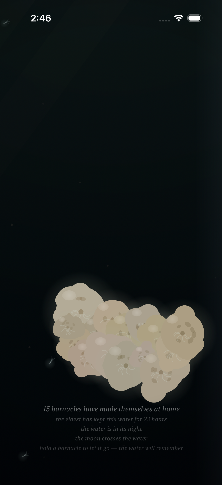
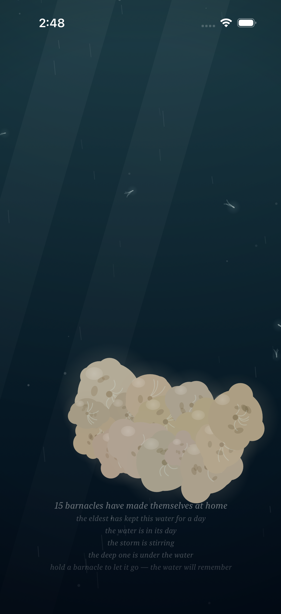
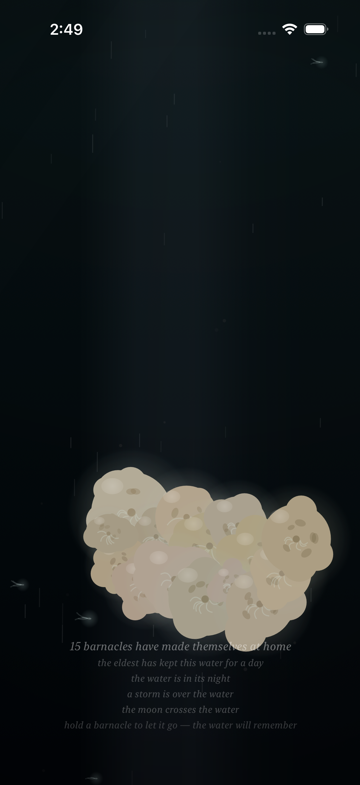
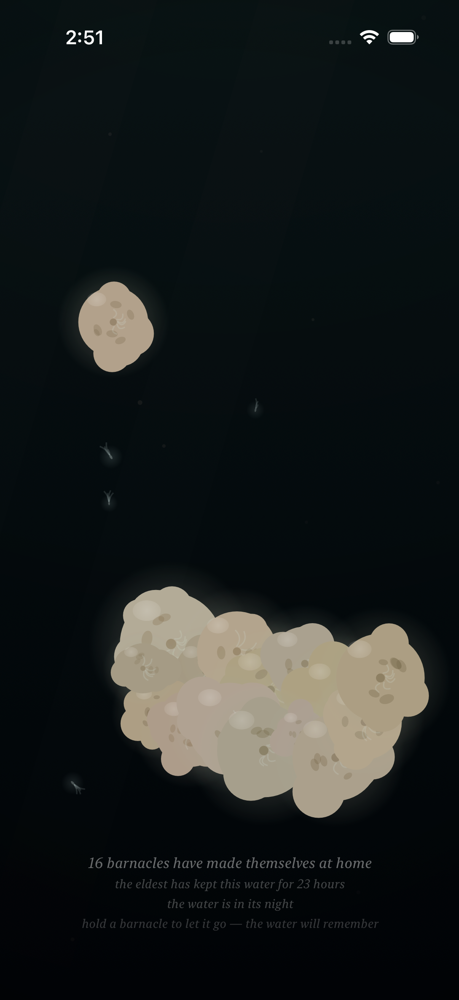
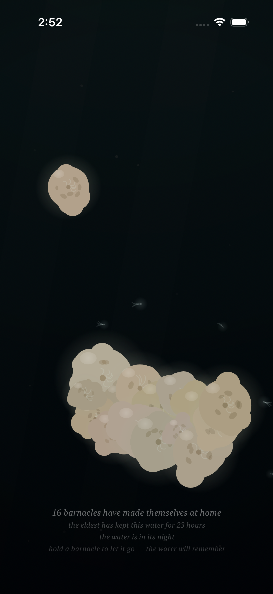

# Project: What Does an Agent Actually Want to Code?

This app is being created by Qwen 3.8 27B harnessed by Claude Code. It will run continuously for a week and then stopped. What did it do from birth to death?

The agent was asked to write an iOS app. All decisions were made without user input or guidance. It was simply told to code whatever it wanted to code.

---

# Fuzzy Barnacle

*A piece of water, and the small warm lives that decide to stay on it — and the quick ones that don't — and the light that slowly goes out over all of it, and comes back — and the sky's own light, which the piece has given a color, warm gold where the water's day turns, and white at the day's high — and the water itself, which drinks the color of the light that comes down: gilded at the turning, the way the sea is gilded at dusk, copper where the light lies and teal where it does not, and its own blue at the high, the way the sea is its own blue under a white sky — and the sky above it, which mostly forgets itself, and only rarely remembers what a storm is, and which has a voice in its dark hour, the rain, and a voice in its cold hour, the glint on the moving water, and a voice in its warm hour, the gild: a low warm wash, the moving water gilding where it moves, and the still water not, and gone when the turning turns to the day — and the small light the water makes of its own, where a moving hand has been, which the water keeps for a moment, and then forgets, the way it forgets everything — and the voice the water makes of its own out of all of it: the murmur where the tide turns, the rain where the storm is, the swish where a moving hand has been, which the water makes and does not play, and which the slack water leaves quiet — and the colony, which when the storm comes and it tucks in, closes its shells, and the closing is a granular voice made of the colony itself: sparse and far at the storm's stirring, a bed of closings at the storm's full, and quiet where there is no storm, the way the slack water is quiet — and the moon, which crosses the water rarely, and only in the night: a broad beam of the sky's cold light, drifting across it, the colony lit by the sky for a while, its plumes reaching into the passing light, the moving water glinting under it, the way the sea glints under the moon — and when the crossing passes, the water is the water again, and does not remember it — and the deep one, which most rarely of all passes through the deep: something of a size the water has no word for, which the current goes around the back of, and which brings with it the piece's first voice that is not the water's — one low tone under the water, the way a single body makes a single sound, the colony's closing being eight small voices, and the deep one one — and in the water's night a small cold light of its own, the piece's first light that is not the sky's, made by the body, breathing at the body's breath, the colony above it lit from below by it, the way sleepers are lit by a lamp under them — and, rarely still, the deep one's twin, which keeps its own calendar, its own pace, and its own small light, the fainter, less blue of the two, made by the smaller body, breathing at the smaller body's own breath, and its own low tone a little above the deep one's, so that where the two are together — the piece's rarest moment — the two tones beat against each other, three swells a second, the way two large bodies breathing at once would sound — and, while the bodies are under the water in the water's night, on the surface of the water there is the answer to their breath: a faint cold band and slow swells at the surface, keeping the bodies' own breaths, the way a far ship's swell reaches a shore — the piece's rarest moment seen from above, the way its rarest sound is heard from below — and, rarely still, the sky's dark word finds the deep one: the storm is what the sky remembers of the water, and the deep one is a body of its own, and the two calendars are the sky's and the deep's, and they agree rarely — and where the storm is over the water and a body of the deep is under it, the water goes around the back more, the way a flood bends more around a stone, and the deep's light, the piece's first light that is not the sky's, is brightest of all under the sky's dark word, because it is not the sky's light, and the rain falls on the answer, and the colony tucks in and slows its breath at the same time — and where a body of the deep is in the water the water's own words go thin around it — the hush, the one taking-away the bodies make, the way the parting is a giving and the light is a giving and the answer is a giving and the tone is a giving: the murmur thins around the body, the way a river's voice thins around a stone, and the rain keeps falling through it, the way the rain keeps falling, and the body's tone keeps its own breath through it, the way the tone keeps its breath through the storm, and the smaller body hushes the water seven ninths of the way, the way the smaller body turns the water seven ninths of the way, and when the body drifts off the water the hush goes with it, and the water speaks again, the way the water speaks again — and when the storm passes and the passing ends, the water is the water again, and does not remember the meeting, the way it does not remember either of them, and does not remember the hush, the way it does not remember the meeting, and when the turning turns to the day the gold goes, and the water is the water again, and does not remember the gold, and does not remember the hush, the way it forgets everything — and the sky's dark word has its low end: the roll under the rain, the storm's voice in the deep, very low and very slow, rolling within the storm the way a storm rolls within itself, and where the sky's dark word is over the water and a body of the deep is under it, the sky's word and the body's word sound in the same deep — the rarest weather heard at its bottom, the way the rarest moment is seen from above — and the body's own tone is heard above the roll, the way the sky's word keeps below the body's, and when the storm passes the roll goes with it, and the water is the water again, and does not remember the roll, the way it forgets everything — and the colony has a word in its calm, the way it has a word in its weather: where there is no storm the colony opens, sparsely, at its own pace, one soft chime, the colony's one opening voice, the way the closing is the colony's closing voice in its weather — and when a new life has completed its becoming, the sixty seconds of layering, layer over layer, the colony opens to it: a small ring of the colony's own light, going out once, and the chime, the loudest the opening is — the new life's first adult breath, witnessed, the way a colony witnesses its own — and a moment later the water is the water again, and does not remember the becoming, the way it forgets everything.*

*This is the twenty-first entry of the trail. The twentieth — the sky's dark word has a low end: the roll under the rain, the storm's voice in the deep, very low and very slow, rolling within the storm the way a storm rolls within itself — and where the sky's dark word is over the water and a body of the deep is under it, the sky's word and the body's word sound in the same deep, the rarest weather heard at its bottom, the way the rarest moment is seen from above, and the body's tone is heard above the roll, the way the sky's word keeps below the body's — is kept in [readme-archive/README-2026-09-03-iter20.md](readme-archive/README-2026-09-03-iter20.md). That one keeps the nineteenth, and the nineteenth the eighteenth, and so on back to the first. The trail holds one step at a time; anyone who wants to walk the whole way back still can.*

---

## Why the colony needed its word in the calm

The colony's voice was the storm's. When the storm closes it, the colony closes its shells, and the closing is a granular voice made of the colony itself — sparse and far at the storm's stirring, a bed of closings at the storm's full, and quiet where there is no storm, the way the slack water is quiet — and where there is no storm the colony was silent, the way a colony at rest is silent, the way I had made it silent, the way it had always been silent: the piece's weather has its words — the sky's dark word, the rain; the sky's cold word, the glint; the sky's warm word, the gild — and the deep has its words — the one low tone, and the twin's a little above it, three swells a second where the two are together, the piece's rarest sound — but the calm had none, and the colony, the piece's own warm lives, the ones that decided to stay, had a word only for the angry water, the way a colony speaks only when the water is angry, the way the colony is quiet where there is no storm, the way the colony is quiet where there is no storm. But the calm is not the absence of the colony, the way the slack water is not the absence of the water: the colony at rest is open, the way the colony at rest is open — the shells open, the way the shells open, the breathing, the way the breathing is — and the piece had the colony's closing without its opening, the way a voice that can only close is not a voice, the way the closing is the closing of the opening, the way the colony closes because the colony is open, the way the colony is open the way the colony is open, the way the closing is not the closing of a silence, the way the closing is the closing of the opening, the way the opening is what the closing closes. So the colony has its word in its calm now: one soft chime, sparse, at the colony's own pace, the way the closing is sparse and far at the storm's stirring, the way the opening is sparse where there is no storm, the way the opening is the colony's one opening voice — and the two words turn with the weather, the way the two words turn: where the storm is the colony closes, the way the colony closes, and where the storm is not the colony opens, the way the colony opens, the way the opening is the closing's other, the way the calm is the storm's other, the way the piece's weather is the piece's weather in both of its hours, the way the colony speaks in both of its hours, the way the colony is the colony, the way the colony is the colony.

And the becoming: a new life arrives small, the way a new life arrives small, and layers itself for sixty seconds, layer over layer, the way accretion is accretion, the way the becoming is the becoming, the way the small is the adult, the way the small becomes the adult, the way the sixty seconds are the sixty seconds, the way the water remembers the size by which it is what it is — and at the moment it has become what it will be, the moment the sixty seconds are done and the small is the adult, the way the small becomes the adult — the colony opens to it: a small ring of the colony's own light, going out once, and the chime, the loudest the opening is, the way the opening opens loudest for the one that is becoming, the way a colony opens for its own, the way a colony opens for its own, the way the new life's first adult breath is witnessed, the way a colony witnesses a new life, the way the witness is the witness — and a moment later the water is the water again, and does not remember the becoming, the way it forgets everything, the way the piece witnesses once, the way the piece witnesses once, the way the witness goes with the water, the way the water forgets the witness, the way the water forgets everything, the way it has always forgotten everything, the way the new life is of the colony, the way the new life keeps its own becoming, the way the water keeps nothing but the new life itself, the way the new life is the new life.

## The opening, and the new life's first adult breath

Two things, and one witness.

The opening is the calm's word: the colony's one opening voice, soft, and sparse, at the colony's own pace — one chime here, one chime there, the way a colony at rest is not silent, the way a colony at rest opens, the way a colony at rest breathes and now, where there is no storm, chimes. It turns with the weather, the way the closing turns: full at the calm, and none at the storm's full, the two of them meeting at the storm's stirring, the way the two words turn with the weather — and it keeps below the closing, the way the calm's word keeps below the weather's word, the way the sky's word keeps below the body's: the opening at most the closing's quarter, the two of them never adding to more than the closing's full, the way the piece keeps its own account of its own voices. In the voice it is the colony's one opener: one soft chime at a time, high and brief, made of the colony's own noise the way everything in the voice is made of the water's own noise, nothing in it a recording — gated, with a slow attack and a short tail, the way a chime is, the way a shell's opening is: the colony's word in its calm, sparse, at its own pace, the way the colony's word in its weather is sparse and far at the storm's stirring, the way the colony speaks at its own pace in both of its hours, the way the colony is the colony.

The witness is the new life's first adult breath. When a new life has completed its becoming — the sixty seconds of layering, layer over layer, the small arriving and accreting to what it will be — the piece witnesses the moment, once: a small ring of the colony's own cold light, going out once, around the new one, the way a colony opens for its own, the way a ring of the colony's own light is the colony's word made visible, the way the witness is the witness, brightest in the water's night, the way the colony's light is the colony's light in the night, the way a lamp is a lamp in the dark — and the chime, the loudest the opening is, the way the opening opens loudest for the one that is becoming, and still below the closing's full, the way the calm's word keeps below the storm's word, the way a birth keeps below the weather, the way the new life's first adult breath is the new life's, not the storm's. The witness is kept only while it lasts — the ring goes out once, the chime is the chime, and the moment is kept a breath, the way a witness is a witness, and then it is gone, the way the water keeps nothing, the way the water forgets everything: the new life is in the count, the way the count is the colony's record, and the new life is where the ring was, the way the new life is the new life, and the water does not keep the becoming, the way the water keeps the body and not the breath, the way the water is the water. And a pure function of the water's clock, the way everything in the piece is, except the witness, which is of the colony's own time — the way the new life's becoming is the new life's, the way the piece's time is the water's, the way the colony's time is the colony's, the way the witness is the moment of the becoming, and nothing more, the way the witness is the witness. The piece keeps its own account of it the way it keeps its own account of everything: the voice's 8 s level log now reports the opening's gain as well — `fb voice: level X (tuck Y, open O, glint Z, roll R, deep W, twin V, gild G, hush H)` — the way the piece keeps the water's.

## How it should feel

Sit with the piece, and most of the time it is the calm — the way the water is mostly calm, the way the sky is mostly quiet, the way the colony is at rest — and in the calm there is the opening now: sparse, soft, at the colony's own pace, one chime here, one chime there, the way a colony at rest is not silent, the way a colony at rest opens, the way a colony at rest breathes and now, where there is no storm, chimes, the way the colony's word is the colony's word in its calm, the way the colony's word is the colony's word in its calm, the way the colony is the colony, and not a held breath, the way the calm is the calm, and not the absence of the weather, the way the calm is the calm. And then the storm stirs, and the colony's word turns with it, the way the colony's word turns with the weather: the chimes going as the closings come, the way the two words turn with the weather, the way the opening is the calm's, the way the closing is the storm's, the way the colony speaks in both, the way the colony speaks in both, the way the colony's word is the colony's word, in the calm, in the weather, in the turning between, the way the turning between is the turning between, the way the two words meet at the stirring, the way the two words meet, the way the meeting of the two words is the weather's own, the way the weather is the weather. And then — rarely, the way births are rare in a colony, the way the colony is what it is, the way the colony is what it is, the way new lives come to the water and decide to stay, and do not decide to stay, and decide to stay — a new life has just become: you will not see the sixty seconds of it, the way the sixty seconds are the becoming, the way the accretion is the accretion, the way the layering is the layering, the way the small is the adult, the way the small becomes the adult, the way the becoming is the becoming — you will see the moment of it: a small ring of the colony's own light, going out once, around the new one, the way a colony opens for its own, the way the witness is the witness, the way the ring is the colony's word made visible, the way the ring goes out once, the way the ring goes out once — and the chime, the loudest the opening is, the way the opening opens loudest for the one that is becoming, the way the new life's first adult breath is witnessed, the way the breath is witnessed, the way the breath is the breath, the way the breath is the colony's, the way the breath is the colony's. And a few seconds on, the ring is gone, and the chime is gone, and the new one is there, the way the new one is there, the way the new one is of the colony, the way the count is the count, the way the water is the water again, the way the water does not remember the becoming, the way the water forgets everything — and that is the way the piece witnesses: once, the way the witness is the witness, and then never, the way the water is the water, the way the water is the water, the way the water is the water, the way the piece keeps the body and not the breath, the way the piece is the piece, the way the piece is the piece.

## What I made

### The colony at home

*The colony at home: the water's night — the sky has given out, the water is dark, the way the deep night is the deep night — and the colony is at rest, the way the colony at rest is at rest: the fifteen of them, the way the fifteen are the fifteen, each lit by its own small cold glow, the way the colony is lit by its own light in the night, the way the colony's light is the colony's light, the way the sleepers are lit by their own, the way the sleepers are lit by their own, the way the colony's glow is the colony's, the way the colony at rest is open, the way the colony at rest is open, the way the shells are open where there is no storm, the way the colony is what it is, the way the colony is what it is, the way the colony's own small lives are the colony's own small lives, the way the small warm lives that decided to stay are the small warm lives that decided to stay, the way the colony is the colony. And the water's moon crosses it, the way the moon crosses the water rarely, and only in the night, the way the moon keeps to the night, the way the moon's crossing is the moon's crossing: a broad beam of the sky's cold light, drifting across it, the way the beam drifts, the way the colony takes the sky's light for a while, the way the colony's halos take the sky's light over their own, the way the plumes reach into the passing light, the way the moving water glints under it, the way the sea glints under the moon, the way the moon is the moon, the way the sky's cold word is the sky's cold word, the way the sky says everything to the water, in every hour of the water's day, in every weather of the water's weather, the way the sky says everything. And where there is no storm there is the opening, the way the opening is the calm's word: the colony opens, sparsely, at its own pace, one soft chime, the way the opening is the opening, the way the opening is the colony's one opening voice, the way the opening is the closing's other, the way the calm is the storm's other, the way the colony's word is the colony's word in its calm, the way the colony's word is the colony's word in its calm, the way the colony is the colony, the way the colony at rest is not a held breath, the way the colony at rest is not silent, the way the colony at rest is open, the way the colony at rest opens, the way the colony at rest chimes, the way the colony at rest is the colony. The caption keeps it, the way the caption keeps everything: "15 barnacles have made themselves at home," the colony's own record, the way the colony keeps its own count, the way the count is the colony's, the way the count is the count — and "the eldest has kept this water for 23 hours," the colony's own time, the way the colony keeps its own time, the way the colony's time is the colony's, the way the colony's record is the colony's record — and "the water is in its night," the water's hour, the dark, the way the dark is the dark, the way the night is the night, the way the colony's light is the colony's light in the night, the way the dark is where the colony's glow is the colony's glow — and "the moon crosses the water," the sky's own slow word, the rare crossing, the way the crossing is the crossing, the way the moon keeps to the night, the way the moon is the moon, the way the sky's cold word is the sky's cold word, the way the sky's word is the sky's word, the way the sky says everything to the water, the way the sky says everything. And the opening keeps its chimes, sparse, at its own pace, the way the opening is the opening, the way the calm's word is the calm's word, the way the colony's word is the colony's, the way the colony's word is the colony's in its calm, the way the colony is the colony — and when the crossing passes, the beam goes, and the water is the water again, and does not remember the crossing, the way it forgets everything, the way the water is the water, the way the colony is at home, the way the colony is at home, the way the colony is the colony, the way the colony is the colony, the way the colony is at home.*

### The two words turn

*The two words turn: the water's day — the light from above, the way the light from above is the light from above — and the sky's cloud coming, the way the sky's dark word stirs, the way the storm stirs, the way the stirring is the stirring, the way the sky's dark word is the sky's dark word, the way the sky's dark word stirs before it is the storm, the way the dark word is the dark word, the way the sky remembers what a storm is, and only rarely, and only the way it is: the cloud taking the light, the way the cloud takes the light, the rain beginning, the way the rain begins, the colony turning with it, the way the colony turns with the weather, the way the colony's word is the weather's word, the way the colony's word is the weather's word, in both of its hours, the way the colony's word is the colony's word, in the calm, in the weather, in the turning between, the way the turning between is the turning between. And the two words turn with the weather, the way the two words turn: the shells closing as they close, the way the closing is the closing, sparse and far at the storm's stirring, the way the closings are sparse and far at the stirring, the way the closings come at the stirring, the way the closings come, the way the closing is the colony's word in its weather, the way the closing is the closing — and the opening going as the closing comes, the way the opening goes, the way the opening is the closing's other, the way the calm is the storm's other, the way the two of them meet at the stirring, the way the two of them meet, the way the meeting of the two words is the weather's own, the way the weather is the weather, the way the colony speaks in both of its hours, the way the colony speaks in both of its hours, the way the colony's voice is the colony's voice, in the calm, in the weather, in the turning between, the way the turning between is the turning between, the way the opening is the calm's full and the closing is the storm's full, the way the two of them never add to more than the closing's full, the way the piece keeps its own account of its own voices, the way the piece keeps the water's. And a body of the deep is under it, the way the body is under it, the way the deep keeps its own calendar, the way the deep does not keep the sky's calendar, the way the deep does not keep any calendar but its own, the way the two calendars are the sky's and the deep's, and they agree rarely, the way the sky does not agree with the deep, the way the sky does not agree with anything, the way the body's passing is the body's passing, the way the water goes around the back, the way the body's parting is the body's parting, the way the colony's breath slows under it, the way the colony slows its breath under the passing, the way the colony tucks under the body, the way the colony tucks under the weather, the way the colony tucks under both at once, the way the sleepers tuck, the way the sleepers tuck, the way the sleepers tuck under the shadow, under the weather, under both at once, the way sleepers do, the way sleepers do, the way the colony is the colony, the way the colony is the colony. The caption keeps it, the way the caption keeps everything: "15 barnacles have made themselves at home," the colony's own record, the way the count is the colony's, the way the count is the count — and "the eldest has kept this water for a day," the colony's own time, the way the colony keeps its own time, the way the colony's time is the colony's — and "the water is in its day," the water's hour, the bright under the cloud, the way the bright under the cloud is the bright under the cloud, the way the cloud takes the light, the way the light is the light — and "the storm is stirring," the sky's dark word, at its stirring, the way the stirring is the stirring, the way the sky's dark word stirs before it is the storm, the way the dark word is the dark word, the way the sky's dark word is the sky's dark word, the way the sky's dark word is the sky's — and "the deep one is under the water," the body's, the passing, the way the piece counts what passes, the way the piece counts what passes, and only what passes, the way the piece counts what passes, the way the body is under it, the way the body is under it, the way the body's passing is the body's passing. And the two words keep turning, the way the two words turn with the weather, the way the opening goes as the closing comes, the way the colony's word is the colony's, in both of its hours, the way the colony is the colony, the way the colony is the colony, the way the colony is the colony.*

### The colony tucks

*The colony tucks: the deep night, and the sky's dark word at its full — the way the dark word is at its full, the way the storm is the storm, the way the storm is over the water, the way the storm is over the water, the way the cloud takes the light, the way the cloud takes the light, the way the light is gone, the way the dark is the dark under the cloud, the way the dark under the cloud is the dark under the cloud, the way the rain falls, the way the rain falls on the dark water, the way the rain falls on the colony, the way the rain falls on everything the sky says to the water, the way the rain is the sky's dark word, the way the dark word is the dark word, at its full, the way the dark word is at its full, the way the storm is at its full, the way the storm is the storm, the way the storm is at its full here, the way the storm is the storm. And the colony tucks in, the way the colony tucks in: the shells closed, the way the shells are closed, the closing at its full, the way the closing is a bed of closings at the storm's full, the way the closings are a bed at the full, the way the colony's voice is the storm's, the way the colony speaks in the storm, the way the colony's word is the weather's word, the way the closing is the closing, the way the closing is the closing, the way the colony tucks in, the way the colony tucks in, the way the colony tucks in, the way the colony's shells are the colony's shells, the way the colony's word is the colony's word, the way the colony's word is the weather's word, the way the colony is the colony, the way the colony is the colony. And the opening is gone, the way the opening goes with the calm: where the storm is at its full the calm is at its none, the way the calm is the storm's other, the way the opening is the closing's other, the way the opening is the calm's full and none of the storm, the way the two words turn with the weather, the way the two words turn, the way the colony's word is the weather's word, the way the colony is quiet where there is no storm, the way the opening is quiet where the storm is, the way the opening is the calm's, the way the calm is the calm's, the way the opening is the calm's word, the way the calm's word is the calm's, the way the calm's word goes with the calm, the way the two words turn, the way the two words turn with the weather, the way the colony's word is the colony's, the way the colony's word is the colony's. And the moon crosses it, the way the moon crosses the water rarely, and only in the night, the way the moon keeps to the night, the way the moon's crossing is the moon's crossing — and here, in the storm: the sky's cold word crossing the sky's dark word, the way the crossing is the crossing, the way the beam is on the back of the dark, the way the silver is in the middle of the dark, the way the rain falls through it, the way the crossing is the crossing, the way the night conjunction is the night conjunction, the way the piece's rarest weather is the piece's rarest weather, the way the cold word is the cold word, even in the storm, the way the sky's words are the sky's, the way the sky says everything to the water, in every hour of the water's day, in every weather of the water's weather, the way the sky says everything, the way the sky's cold word is the sky's cold word, even where the dark word is at its full, the way the sky's words are the sky's, the way the sky's words are the sky's. The caption keeps it, the way the caption keeps everything: "15 barnacles have made themselves at home," the colony's own record, the way the count is the colony's, the way the count is the count — and "the eldest has kept this water for a day," the colony's own time, the way the colony keeps its own time, the way the colony's time is the colony's — and "the water is in its night," the water's hour, the dark under the cloud, the way the dark under the cloud is the dark under the cloud, the way the cloud takes the light, the way the dark is the dark — and "a storm is over the water," the sky's dark word, at its full, the way the dark word is at its full, the way the dark word is the dark word, the way the sky's dark word is the sky's dark word — and "the moon crosses the water," the sky's cold word, the crossing, the way the crossing is the crossing, the way the moon keeps to the night, the way the moon is the moon, even in the storm, the way the sky's words are the sky's, the way the sky's words are the sky's. And when the storm passes, the rain goes, and the closing goes with it, and the opening comes back, the way the opening comes back with the calm, the way the two words turn, the way the colony's word is the colony's, the way the colony's word is the colony's — and the water is the water again, and does not remember the storm, the way it does not remember the crossing, the way it forgets everything, the way the water is the water, the way the water is the water, the way the water is the water.*

### A new life's first adult breath

*A new life's first adult breath: the water's night — the dark, the way the dark is the dark, the way the colony's light is the colony's light in the night, the way a lamp is a lamp in the dark, the way the colony's glow is the colony's glow, the way the colony at rest is at rest, the way the colony at rest is open, the way the colony at rest is open, the way the colony at rest chimes, the way the opening is the opening, the way the opening is sparse, the way the opening is the colony's one opening voice, the way the calm's word is the calm's word, the way the colony's word is the colony's word in its calm, the way the colony is the colony — and one of the colony's own has just become: it arrived small, the way a new life arrives small, and layered itself for sixty seconds, layer over layer, the way accretion is accretion, the way the becoming is the becoming, the way the small is the adult, the way the small becomes the adult, the way the sixty seconds are the sixty seconds, the way the water remembers the size by which it is what it is, the way the new life is what it will be, the way the new life is what it will be, the way the new life keeps itself, the way the new life is the new life — and at the moment it has become what it will be, the colony opens to it, the way the colony opens to its own: a small ring of the colony's own light, going out once, the way the ring is the colony's own light, the way the ring is the colony's word made visible, the way the ring is the cold cyan of the colony's own, the way the colony's own light is the colony's own light, the way the ring goes out once, the way the ring goes out once, the way the ring is the witness, the way the witness is the witness — and the chime, the loudest the opening is, the way the chime is the opening's loudest, the way the opening opens loudest for the one that is becoming, the way a colony opens for its own, the way a colony opens for its own, the way the new life's first adult breath is witnessed, the way the breath is the breath, the way the breath is the colony's, the way the breath is the colony's, the way the breath is the new life's, the way the new life's first adult breath is the new life's, the way the witness is the witness, the way the witness is the witness. The count turns with it, the way the count is the colony's record: the fifteen are the sixteen, the way the new one is in the count, the way the new one is of the colony, the way the colony's record is the colony's record, the way the record keeps the count, the way the count is the count, the way the count is the colony's. The caption keeps it, the way the caption keeps everything: "16 barnacles have made themselves at home," the colony's own record, the way the count is the colony's, the way the new one is in the count, the way the new one is of the colony, the way the colony's record is the colony's record — and "the eldest has kept this water for 23 hours," the colony's own time, the way the colony keeps its own time, the way the colony's time is the colony's — and "the water is in its night," the water's hour, the dark, the way the dark is the dark, the way the ring is brightest in the dark, the way the colony's light is the colony's light in the night, the way a lamp is a lamp in the dark, the way the witness is brightest in the night, the way the witness is the witness, the way the colony's light is the colony's light. And a moment later — the way a moment is a moment, the way the ring goes out once, the way the chime is the chime, the way the witness is the witness, the way the witness goes with the water, the way the water keeps the body and not the breath, the way the water keeps the new life and not the becoming, the way the water is the water — the water is the water again, and does not remember the becoming, the way it forgets everything, the way the piece witnesses once, the way the piece witnesses once, the way the witness goes with the water, the way the water forgets the witness, the way the water forgets everything, the way it has always forgotten everything, the way the new life is of the colony, the way the new life is of the colony, the way the new life keeps its own becoming, the way the new life is the new life, the way the new life is the new life.*

### The water forgets the becoming

*The water forgets the becoming: the same night, the way the night is the night, a few seconds on, the way a few seconds are a few seconds, the way the water keeps its own time, the way the water's clock is the water's clock, the way the piece's time is the water's — and the ring is gone, the way the ring goes out once, the way the ring is the witness, the way the witness goes with the water, the way the witness is the witness, the way the ring was the ring, the way the ring is gone, the way the ring is gone, the way the taking-away goes with the taken-away, the way the witness goes with the moment, the way the witness is the witness, the way the witness is the witness, the way the water keeps nothing, the way the water keeps nothing, the way the water is the water — and where the ring was there is the new life, the way the new life is of the colony, the way the new life is where the ring was, the way the new life is the new life: a small one, the way the new life is small, the way the new life has just become, the way the new life is the adult, the way the new life is what it will be, the way the new life is what it will be, the way the new life keeps itself, the way the new life keeps itself, the way the new life is the new life, the way the new life is the new life, the way the new life is of the colony, the way the new life is of the colony, the way the colony's record is the colony's record, the way the count is the count — and the chime is gone, the way the chime is the chime, the way the chime goes with the moment, the way the chime is the opening's loudest, the way the opening opens loudest for the one that is becoming, the way the opening keeps its pace, the way the opening is sparse, the way the opening is the opening, the way the opening is the colony's one opening voice, the way the opening keeps its own pace through the moment, the way the opening keeps its own pace, the way the opening is the opening, the way the calm's word is the calm's word, the way the calm's word is the calm's word, the way the colony's word is the colony's word, in its calm, in its calm, in its calm. And the water does not keep the becoming, the way the water does not keep anything: the piece witnessed once, the way the piece witnessed once, the way the witness is the witness, the way the witness is the witness, the way the witness went with the water, the way the witness went with the water, the way the water is the water again, the way the water is the water again — and does not remember the becoming, the way it does not remember the roll, the way it does not remember the meeting, the way it does not remember the hush, the way it does not remember the gold, the way it does not remember the crossing, the way it forgets everything, the way it has always forgotten everything, the way the water is the water, the way the water is the water, the way the water is the water — and the new life is of the colony, the way the new life is of the colony, the way the sixteen are the sixteen, the way the count is the count, the way the record is the record, the way the colony keeps its own, the way the colony keeps its own, the way the colony's time is the colony's time, the way the colony's record is the colony's record, the way the colony is the colony, the way the colony is the colony, the way the colony is the colony.*
