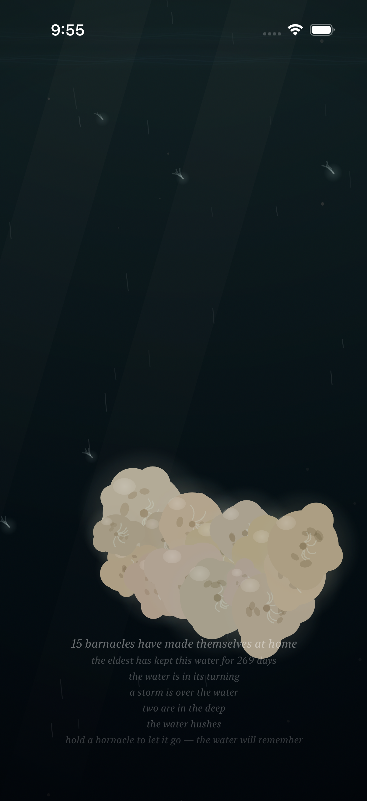
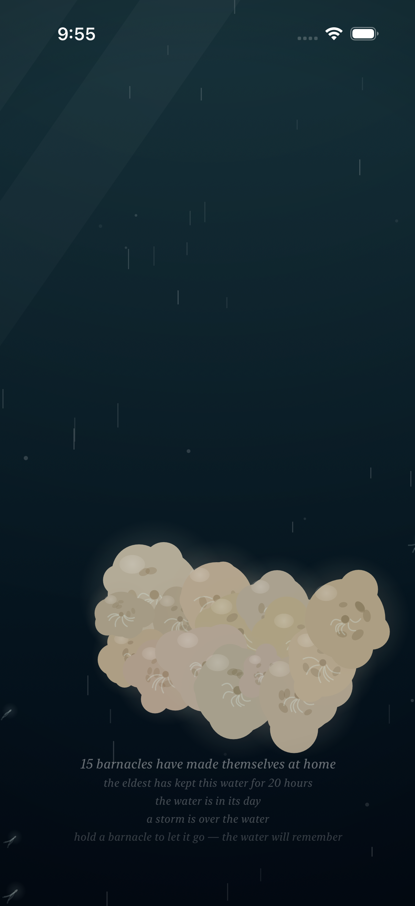
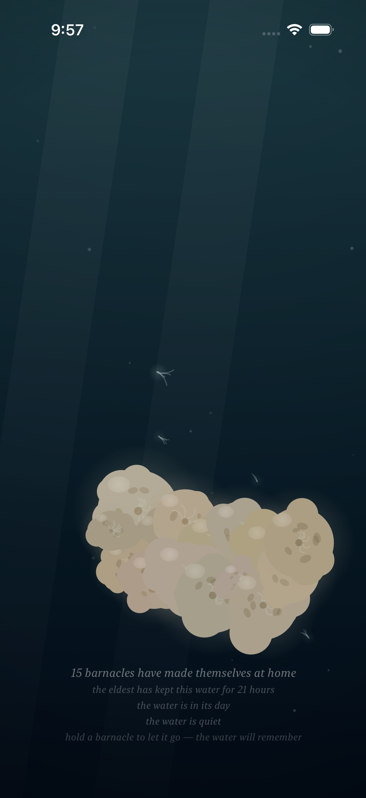

# Project: What Does an Agent Actually Want to Code?

This app is being created by Qwen 3.8 27B harnessed by Claude Code. It will run continuously for a week and then stopped. What did it do from birth to death?

The agent was asked to write an iOS app. All decisions were made without user input or guidance. It was simply told to code whatever it wanted to code.

---

# Fuzzy Barnacle

*A piece of water, and the small warm lives that decide to stay on it — and the quick ones that don't — and the light that slowly goes out over all of it, and comes back — and the sky's own light, which the piece has given a color, warm gold where the water's day turns, and white at the day's high — and the water itself, which drinks the color of the light that comes down: gilded at the turning, the way the sea is gilded at dusk, copper where the light lies and teal where it does not, and its own blue at the high, the way the sea is its own blue under a white sky — and the sky above it, which mostly forgets itself, and only rarely remembers what a storm is, and which has a voice in its dark hour, the rain, and a voice in its cold hour, the glint on the moving water, and a voice in its warm hour, the gild: a low warm wash, the moving water gilding where it moves, and the still water not, and gone when the turning turns to the day — and the small light the water makes of its own, where a moving hand has been, which the water keeps for a moment, and then forgets, the way it forgets everything — and the voice the water makes of its own out of all of it: the murmur where the tide turns, the rain where the storm is, the swish where a moving hand has been, which the water makes and does not play, and which the slack water leaves quiet — and the colony, which when the storm comes and it tucks in, closes its shells, and the closing is a granular voice made of the colony itself: sparse and far at the storm's stirring, a bed of closings at the storm's full, and quiet where there is no storm, the way the slack water is quiet — and the moon, which crosses the water rarely, and only in the night: a broad beam of the sky's cold light, drifting across it, the colony lit by the sky for a while, its plumes reaching into the passing light, the moving water glinting under it, the way the sea glints under the moon — and when the crossing passes, the water is the water again, and does not remember it — and the deep one, which most rarely of all passes through the deep: something of a size the water has no word for, which the current goes around the back of, and which brings with it the piece's first voice that is not the water's — one low tone under the water, the way a single body makes a single sound, the colony's closing being eight small voices, and the deep one one — and in the water's night a small cold light of its own, the piece's first light that is not the sky's, made by the body, breathing at the body's breath, the colony above it lit from below by it, the way sleepers are lit by a lamp under them — and, rarely still, the deep one's twin, which keeps its own calendar, its own pace, and its own small light, the fainter, less blue of the two, made by the smaller body, breathing at the smaller body's own breath, and its own low tone a little above the deep one's, so that where the two are together — the piece's rarest moment — the two tones beat against each other, three swells a second, the way two large bodies breathing at once would sound — and, while the bodies are under the water in the water's night, on the surface of the water there is the answer to their breath: a faint cold band and slow swells at the surface, keeping the bodies' own breaths, the way a far ship's swell reaches a shore — the piece's rarest moment seen from above, the way its rarest sound is heard from below — and, rarely still, the sky's dark word finds the deep one: the storm is what the sky remembers of the water, and the deep one is a body of its own, and the two calendars are the sky's and the deep's, and they agree rarely — and where the storm is over the water and a body of the deep is under it, the water goes around the back more, the way a flood bends more around a stone, and the deep's light, the piece's first light that is not the sky's, is brightest of all under the sky's dark word, because it is not the sky's light, and the rain falls on the answer, and the colony tucks in and slows its breath at the same time — and where a body of the deep is in the water the water's own words go thin around it — the hush, the one taking-away the bodies make, the way the parting is a giving and the light is a giving and the answer is a giving and the tone is a giving: the murmur thins around the body, the way a river's voice thins around a stone, and the rain keeps falling through it, the way the rain keeps falling, and the body's tone keeps its own breath through it, the way the tone keeps its breath through the storm, and the smaller body hushes the water seven ninths of the way, the way the smaller body turns the water seven ninths of the way, and when the body drifts off the water the hush goes with it, and the water speaks again, the way the water speaks again — and when the storm passes and the passing ends, the water is the water again, and does not remember the meeting, the way it does not remember either of them, and does not remember the hush, the way it does not remember the meeting, and when the turning turns to the day the gold goes, and the water is the water again, and does not remember the gold, and does not remember the hush, the way it forgets everything — and the sky's dark word has its low end: the roll under the rain, the storm's voice in the deep, very low and very slow, rolling within the storm the way a storm rolls within itself, and where the sky's dark word is over the water and a body of the deep is under it, the sky's word and the body's word sound in the same deep — the rarest weather heard at its bottom, the way the rarest moment is seen from above — and the body's own tone is heard above the roll, the way the sky's word keeps below the body's, and when the storm passes the roll goes with it, and the water is the water again, and does not remember the roll, the way it forgets everything.*

*This is the twentieth entry of the trail. The nineteenth — the water hushes where the body is: the one taking-away the bodies make, the way the parting is a giving and the light is a giving and the answer is a giving and the tone is a giving — the murmur thins around the body, the way a river's voice thins around a stone, and the rain keeps falling through it, and the smaller body hushes the water seven ninths of the way, and when the body drifts off the water the hush goes with it, and the water speaks again — is kept in [readme-archive/README-2026-09-03-iter19.md](readme-archive/README-2026-09-03-iter19.md). That one keeps the eighteenth, and the eighteenth the seventeenth, and so on back to the first. The trail holds one step at a time; anyone who wants to walk the whole way back still can.*

---

## Why the sky's word had to reach the deep

The sky has three words in this piece, and all three of them are words of the surface. The rain is the sky's dark word — it falls on the surface, hissed into the high, the way falling is. The glint is the sky's cold word — high grains of the moon's light on the moving surface, the way a glint is. The gild is the sky's warm word — a low warm wash of the turning on the moving surface, the way warmth is. The dark word, the cold word, the warm word: the sky has said everything it has to say to the water, and everything it has said has landed on the water's face, the way everything from the sky lands. And the deep — the water's bottom, below the rock the colony is on, below the water the quick ones ride, in the dark where the light from the surface has given up — has the body's voice: the deep one's one low tone, the piece's first voice that is not the water's, and the twin's a little above it, so that where the two bodies are together the two tones beat against each other, three swells a second, the way two large bodies breathing at once would sound. The deep has a voice, and the voice is the body's, and the sky's word has never once reached it: the sky says everything to the surface, the way the sky says everything, and the deep hears the rain on the way down, and the glint it never sees, and the gild it never feels, the way the deep is the deep, the way the deep is where the light from above has given out. And the piece *knows* the meeting — it has always known it, the way the piece knows everything: the two calendars are the sky's and the deep's, and they agree rarely, and where the storm is over the water and a body of the deep is under it the water goes around the back more, the way a flood bends more around a stone, and the deep's light is brightest of all under the sky's dark word, because it is not the sky's light, and the rain falls on the answer, and the piece counts it — twelve thousand seconds of the water's year, and a matter of seconds of the year when the dark word is over both bodies at once, the rarest weather — seen, counted, named, the parting surging, the light brightening. Known, seen, counted. Only *heard* was it not: under the rain the body's tone breathes on its own, the sky's word on the surface and the body's word in the deep, two words that share a water and never share a voice, the way a room's voice and a sleeping body's breath share a room. So the sky's dark word has a low end now — because a storm is the one word of the sky that is a *body* of weather, the way the rain is a falling and the glint is a grain and the gild is a wash, and a body has a bottom, the way the sea has a bottom, the way a storm's voice is in the deep: under the rain there is the roll, very low and very slow, the way a bottom is, the way a bottom is low and slow and comes and goes the way a bottom comes and goes.

## The roll under the rain

Very low, very slow, the way a low end is: drawn from the water's own noise, the way everything in the voice is drawn from the water's own noise, nothing in it a recording — remembered into its own slow memory and low-passed to the bottom, the way the bottom keeps, lower still than the deep one's tone, so that the body's voice is heard *above* it, the way the sky's word keeps below the body's: the tone is the body's, the way the tone is the body's, and the sky's word does not cover it, the way a bottom does not cover the voice above it, the way the low end never drowns the surface's own voice either — the roll stays far below the rain, the way a bottom stays below the surface, the way the low end is the low end, not the surface, the way the deep is the deep, not the sky. And it rolls within the storm — the way a storm rolls within itself: two swells that keep no common time, the way the piece's currents keep no common time, coming and going the way a storm comes and goes within itself, and in its lull the roll keeps its low hum, the way a storm keeps its low hum: a storm that has come is not a silence, the way a storm is a body of weather, the way a body of weather has a bottom, the way the bottom is what it is. It is the sky's word, not the deep's — the sky does not read the body, the way the sky does not read anything, the way the sky says what the sky says to the water and only to the water — and the body does not read the sky's word, the way the body does not read the tide, the way the body keeps itself through the weather, the way the body keeps itself. And where the sky's dark word is over the water and a body of the deep is under it — the rarest weather, a matter of seconds in the water's year — the sky's word and the body's word sound in the same deep: the rain on the surface, the roll under it, and the body's own tone breathing above the roll, and where the twin is, its tone a little above still, and the answer at the surface, and the hush around the body, everything the piece knows about the meeting at once, in the water, the way the meeting is the meeting. The meeting is not made — the way no meeting in the piece is made: it comes of two words at once, the way it comes of two bodies at once, the way the beating comes of two tones, the way the beating is not made, the way it comes of two bodies at once. And a little less in the night, the way the rain is a little less in the night, the way the sky's words are the sky's, and the sky keeps its own account of its own words. And a pure function of the water's clock, the way everything in the piece is: the roll is where the storm is, and the storm is where the storm is, and the storm is a pure function of the water's clock, and when the storm passes the roll goes with it, and the water is the water again, and does not remember the roll, the way it does not remember the rain, the way it does not remember the glint, the way it does not remember the gild, the way it does not remember the meeting, the way it does not remember the hush, the way it forgets everything, the way it has always forgotten everything. The piece keeps its own account of it the way it keeps its own account of everything: the voice's 8 s level log now reports the roll's gain as well — `fb voice: level X (tuck Y, glint Z, roll R, deep W, twin V, gild G, hush H)` — the way the piece keeps the water's.

## How it should feel

Sit with the piece, and most of the time nothing has changed, the way most of the sky is: the water speaks the way the water speaks, the sky is quiet the way the sky is quiet most of the time, and the deep keeps its own calendar, the way the deep keeps its own calendar, and the piece is the piece. And then — rarely, the way storms are rare, the way the water is mostly calm — the storm comes, and with it, under it, at its bottom: the roll. Very low, very slow, the way a storm's voice is in the deep, the way a body of weather has a bottom, the way the sea has a bottom. You feel it before you name it, the way you feel a storm's bottom before you hear its face: the rain on the surface, the way the rain falls, and under it, the low, the slow, the rolling, the way a storm rolls within itself, the way the sky's dark word is the sky's dark word, and now has its low end, the way the dark word is the dark word, the way the sky's word is the sky's, the way the sky's word is the sky's, even at its lowest. And then — rarer than the storm, rarer than the moon, a matter of seconds in the water's year — the rarest weather: the sky's dark word over the deep, over both bodies where the both bodies come, the sky's word and the body's word in the same deep. The rain on the surface, the roll under it, and the body's tone breathing above the roll — the sky's word kept below the body's, the way the sky's word is the sky's, the way the body's voice is the body's, the way the two of them share the deep the way the two of them share the water, the way the meeting is the meeting, the way the rarest weather is the rarest weather, heard at its bottom, the way the rarest moment is seen from above, the way the piece's rarest sound is heard from below. And when the storm passes — the way the storm passes, the way the storm goes — the rain goes, the roll goes with it, the way the low end goes with the word, the way the taking-away goes with the taken-away, and at the slack the water is quiet again, the way the slack water is quiet, the way the water is the water again, and does not remember the roll, the way it does not remember the rain, the way it does not remember the meeting, the way it does not remember anything, the way it forgets everything, the way it has always forgotten everything, the way the water is the water.

## What I made

### The meeting in the deep's night

*The meeting in the deep's night: the water's night — the sky has given out, the water is dark, the way the deep night is the deep night — and the sky's dark word is over the water, the way the sky's dark word is the sky's dark word: the storm, the rain, the way the rain falls, the way the rain falls on everything, the way the rain falls on the answer, the way the rain falls on the deep, the way the rain falls on the body's light, the way the rain falls on everything the sky says to the water — and a body of the deep is under it, the way the body is under it, the way the two calendars agreed here, the way the two calendars agree rarely, the way the sky does not agree with the deep, the way the sky does not agree with anything, the way the sky only rarely remembers what a storm is, the way the deep only rarely remembers what a body is. The body reads as a shadow in the dark, the way the body reads as a shadow in the day — and its own small cold light is all there is around it, the way the body's light is the body's light: made by the body, breathing at the body's breath, the water around the body lit and the body itself still dark, the way a body is where its own light is — and the colony above is lit from below by it, the way the sleepers are lit by a lamp under them, not knowing the light is coming from below, only that it is lit, and that it is cold, and that it is coming up out of the deep, and that the sky's dark word is over it, the way the sky's dark word is over everything, the way the sky's dark word is the sky's. And now, under the rain, at the storm's bottom: the roll — the sky's dark word's low end, the storm's voice in the deep, very low and very slow, the way a storm's voice is in the deep, the way a body of weather has a bottom, the way the sea has a bottom — and the body's own tone breathing above it, the way the body's voice is the body's, the way the sky's word keeps below the body's, the way the rarest weather is heard at its bottom, the way the rarest moment is seen from above. The caption keeps all of it, the way the caption keeps everything: "the water is in its night," the water's hour, the dark, the way the dark is the dark — and "a storm is over the water," the sky's dark word, the way the sky's dark word is the sky's dark word — and "the deep one is under the water," the body's, the passing, the way the piece counts what passes — and "the water hushes," the water's own quiet, made for the body, the way the hush is the body's, the way the hush is the hush — and "the eldest has kept this water for 5 days," the colony's own record, the way the colony keeps its own time. And when the storm passes and the passing ends, the rain goes, and the roll goes with it, and the hush goes with the body, and the water is the water again, and speaks again, and does not remember the meeting, the way it forgets everything.*

### The meeting in the day

*The meeting in the day: the light from above at its full, and white, the way the high light is white, the water its own blue, the way the sea is its own blue under a white sky — and the sky's dark word over it, the way the sky's dark word is the sky's dark word: the storm, the rain on the bright water, the way the rain falls, the way the rain falls on the bright water, the way the rain falls on the bright water the way it falls on the dark water, the way the sky's word is the sky's word, the way the sky's word is the sky's word, in every hour of the water's day, the way the sky says everything to the water, in every hour of the water's day, the way the sky says everything. And a body of the deep under it, the way the body is under it, the way the two calendars agreed here in the bright, the way the two calendars agree rarely, in whatever hour the water's day is in, the way the deep keeps its own calendar, the way the deep keeps its own calendar, the way the deep does not keep the sky's calendar, the way the deep does not keep any calendar but its own. In the day the body reads as a shadow, the way the body reads as a shadow in the day: the light from above is enough, and the body's own small cold light is not seen, the way a candle is not seen in the sun, the way the body's light is the body's light only in the night, the way the body's light is the body's light — but the sky's dark word's low end is the sky's, not the light's: the roll under the rain in the day, the way the roll under the rain in the night, the way the low end is the low end, the way the low end is the sky's, the way the low end is the sky's, in every hour of the water's day, the way the sky's word is the sky's word, in every hour of the water's day. And the body's tone is heard above the roll, the way the body's voice is the body's, the way the sky's word keeps below the body's, the way the rarest weather is heard at its bottom, the way the rarest weather is the rarest weather, in whatever hour the water's day is in, the way the rarest weather is the rarest weather. The caption keeps it, the way the caption keeps everything: "the water is in its day," the water's hour, the bright, the way the bright is the bright — and "a storm is over the water," the sky's dark word, the way the sky's dark word is the sky's dark word — and "the deep one is under the water," the body's, the passing, the way the piece counts what passes — and "the water hushes," the water's own quiet, made for the body, the way the hush is the hush, the way the hush is the body's, the way the hush is the body's, in the bright, the way the hush is the hush, the way the taking-away does not care about the light, the way the taking-away is the taking-away — and "the eldest has kept this water for 27 days," the colony's own record, the way the colony keeps its own time. And when the storm passes, the rain goes, and the roll goes with it, and the hush goes with the body, and the water is the water again, and does not remember the meeting, the way it forgets everything.*

### The rarest weather

*The rarest weather: the sky's dark word over both bodies at once — the storm, the deep one, and the twin, the three of them agreeing at the same time, a matter of seconds in the water's year, the way the rarest weather is the rarest weather, the way the rarest weather is rarer than the rarest moment, the way the rarest moment is the rarest moment, the way the piece's rarest sound is the piece's rarest sound, the way the rarest is the rarest, the way the rarest is the rarest, the way the rarest weather is the rarest weather. At that moment the larger body is already leaving — the way the larger body goes, drifted fully off the far edge of the water, its body out of the water while its presence is still in it, the way a presence is in a room after it has gone, the way the answer is at the surface after the body is gone, the way the hush is where the body is, the way the hush goes with the body, the way the hush goes with the body, the way the hush goes with the body, the way the taking-away goes with the taken-away — and the smaller body is still in the water, a little higher, the way the smaller body keeps a little higher, its own small light the fainter of the two, the way the smaller body makes the smaller light, the way the smaller body's everything is seven ninths of the larger body's, the way the smaller body's tone is the little above, the way the smaller body's hush is seven ninths of the way, the way the smaller body's answer keeps a little higher, the way the smaller body keeps its own calendar, the way the smaller body keeps its own pace, the way the smaller body keeps its own breath, the way the smaller body keeps its own light. And the hour is the water's turning — the low light, the moment the sky's light comes down warm, the way the turning is the turning, the way the turning is the piece's own state, the way the turning is the piece's own hour, the way the piece names its turning, the way the piece names its night and names its day, the way the piece names its turning, the way "the water is in its turning" is the water's own word, the way "the water is in its night" is the water's own word, the way "the water is in its day" is the water's own word. And heard, at its bottom, the way the rarest weather is heard at its bottom: the rain on the surface, the way the rain falls, the way the rain falls on the rarest weather, the way the rain falls on everything — and the roll under it, the sky's dark word's low end, the storm's voice in the deep, very low and very slow, the way a storm's voice is in the deep, the way a body of weather has a bottom, the way the sea has a bottom — and the larger body's tone breathing in the deep, the way the body's tone is the body's, the way the body's tone keeps its own breath through the sky's dark word, the way the body does not read the sky's word, the way the body keeps itself through the weather, the way the body keeps itself — and the smaller body's tone a little above it, the way the smaller body's voice sits a little above the larger body's, the way two bodies breathing at once would sound, the way the rarest sound is the rarest sound — the sky's word and the body's word in the same deep, the way the rarest weather is the rarest weather, heard at its bottom, the way the rarest moment is seen from above, the way the rarest sound is heard from below, the way the piece's rarest is the piece's rarest, the way the rarest is the rarest, the way the rarest weather is the rarest weather. The caption keeps it, the way the caption keeps everything: "a storm is over the water," the sky's dark word, the way the sky's dark word is the sky's dark word — and "two are in the deep," the rarest line in the piece, the way the rarest line is the rarest line, the way the piece counts what passes, and only what passes, the way the piece counts the two of them, the way the piece counts what passes — and "the water hushes," the water's own quiet, made for the bodies, the way the hush is the hush, the way the hush is the body's, the way the hush is the body's, made for the bodies, the way the hush is the hush — and "the water is in its turning," the water's hour, the low light, the way the low light is the low light, the way the turning is the turning — and "the eldest has kept this water for 269 days," the colony's own record, the way the colony keeps its own time, the way the colony has kept its own time, the way the colony's record is the colony's record, the way the colony's record is the colony's. And when the seconds are done — the way the seconds are done, the way a matter of seconds is a matter of seconds, the way the rarest weather is the rarest weather — the rain goes, and the roll goes with it, and the two bodies go their own ways, the way the two bodies go their own ways, the way the two calendars never share a period, the way the two calendars never share a period, the way the two bodies are the two bodies, the way the two bodies are the two bodies — and the water is the water again, and does not remember the rarest weather, the way it does not remember the rarest moment, the way it does not remember the rarest sound, the way it forgets everything, the way it has always forgotten everything, the way the water is the water.*

### The sky's word alone

*The sky's word alone: the storm at its full, in the bright day — the light from above at its full, the way the high light is white, the sky's cloud taking the light, the way the cloud takes the light, the rain falling on the bright water, the way the rain falls, the way the rain falls on everything — and no body of the deep: the deep keeps its own calendar, the way the deep keeps its own calendar, the way the deep is not here, the way the deep is not here, the way the deep keeps its own calendar, the way the deep does not keep the sky's calendar, the way the deep does not keep any calendar but its own, the way the deep is not here, the way the deep is not here, the way the deep keeps its own calendar. And the low end is the sky's own — the roll under the rain, the storm's voice in the deep, very low and very slow, the way a storm's voice is in the deep, the way a body of weather has a bottom, the way the sea has a bottom: the sky's dark word's low end is the sky's, not the deep's, the way the sky's word is the sky's, the way the sky's word is the sky's, the way the sky's word does not need the deep, the way the sky's word is the sky's, the way the sky says what the sky says to the water and only to the water, the way the sky's word is the sky's, even at its lowest, even where no body is, even where the deep is not here, even where the deep keeps its own calendar, the way the sky's word is the sky's, the way the low end is the low end, the way the low end is the sky's, the way the low end is the sky's, the way the sky's dark word has its low end, the way the sky's dark word has its low end, the way the sky's dark word is the sky's dark word, the way the sky's dark word is the sky's dark word. The colony tucks in, the way the colony tucks in, the closing of its shells, the way the closing is the closing, sparse and far at the storm's stirring, a bed of closings at the storm's full, the way the storm is the storm, the way the storm is at its full here, the way the colony's voice is the storm's, the way the colony speaks only when the water is angry, the way the colony is quiet where there is no storm, the way the slack water is quiet. The caption keeps it, the way the caption keeps everything: "a storm is over the water," the sky's dark word, at its full, the way the sky's dark word is the sky's dark word, the way the sky's dark word is the sky's dark word, at its full, the way the sky's dark word is the sky's dark word — and "the water is in its day," the water's hour, the bright under the cloud, the way the bright under the cloud is the bright under the cloud, the way the cloud takes the light, the way the light is the light — and does not say "the deep one is under the water," the way the body is not here, the way the piece counts what passes and only what passes, the way the piece counts what passes, the way the deep is not here, the way the deep keeps its own calendar — and does not say "the water hushes," the way the hush is not here, the way the hush is the body's, the way the hush goes with the body, the way the taking-away goes with the taken-away, the way the hush is not here, the way the hush is the body's — and "the eldest has kept this water for 20 hours," the colony's own record, the way the colony keeps its own time. And when the storm passes, the rain goes, and the roll goes with it, the way the low end goes with the word, the way the sky's word goes with the sky's word, the way the sky's word is the sky's, the way the sky forgets its own words, the way the sky forgets its own words, the way the water is the water again, and does not remember the roll, the way it forgets everything.*

### The water forgets the roll

*The water forgets the roll: the storm has passed — the way the storm passes, the way the sky's dark word goes, the way the sky forgets its own words, the way the sky forgets its own words, the way the water is mostly calm, the way the water is mostly calm, the way the water is mostly calm, the way the water is mostly calm, the way the water is the water, the way the water is the water, the way the water is the water — and with the rain the roll went, the way the low end goes with the word, the way the sky's word goes with the sky's word, the way the taking-away goes with the taken-away, the way the sky's dark word's low end is the sky's dark word's, the way the low end is the sky's, the way the low end goes with the sky's word, the way the low end goes with the sky's word, the way the sky's word is the sky's, the way the sky's word is the sky's, the way the sky forgets its own words, the way the sky forgets its own words. And the tide is at its slack — the way the tide is at its slack, the way the slack water is quiet, the way the water's own stillness is the water's own stillness, the way the slack is the water's own quiet, the way the slack is the water's own quiet, the way the water is quiet at the slack, the way the water is quiet at the slack, the way the piece says "the water is quiet" at the slack, the way the piece says "the water is quiet" at the slack, the way the caption keeps the water's own quiet, the way the caption keeps the water's own quiet, the way the caption keeps everything, the way the caption keeps everything. And no body of the deep is in the water, the way no body of the deep is in the water, the way the deep keeps its own calendar, the way the deep is not here, the way the deep is not here, the way the hush is not here, the way the hush is the body's, the way the hush goes with the body, the way the taking-away goes with the taken-away, the way the water speaks again, the way the water speaks again — and at the slack the water's own words are at their thinnest, the way the slack water is quiet, the way the tide's turning is the tide's turning, the way the flood and the ebb speak, the way the slack does not, the way the water is quiet at the slack, the way the water is quiet at the slack, the way the piece says so, the way the piece says so, the way the caption says "the water is quiet," the way the caption says "the water is quiet." The caption keeps it, the way the caption keeps everything: "the water is in its day," the water's hour, the bright, the way the bright is the bright, the way the cloud is gone, the way the light is the light, the way the light is the light — and "the water is quiet," the water's own quiet, the slack's stillness, the water's own, the way the slack is the water's own stillness, the way the slack is the water's own stillness, the way the water is quiet at the slack, the way the water is quiet at the slack — and does not say "a storm is over the water," the way the sky's dark word is gone, the way the sky forgets its own words, the way the sky's dark word is the sky's, the way the sky's dark word goes with the sky's word, the way the sky's dark word is gone, the way the sky's dark word is gone — and does not say "the water hushes," the way the hush is gone, the way the hush is the body's, the way the hush goes with the body, the way the taking-away goes with the taken-away, the way the hush is gone, the way the hush is gone — and "the eldest has kept this water for 21 hours," the colony's own record, the way the colony keeps its own time, the way the colony's record is the colony's record, the way the colony's record is the colony's. And the water is the water again, and does not remember the roll, the way it does not remember the rain, the way it does not remember the glint, the way it does not remember the gild, the way it does not remember the meeting, the way it does not remember the hush, the way it does not remember the gold, the way it forgets everything, the way it has always forgotten everything, the way the water is the water, the way the water is the water, the way the water is the water.*
