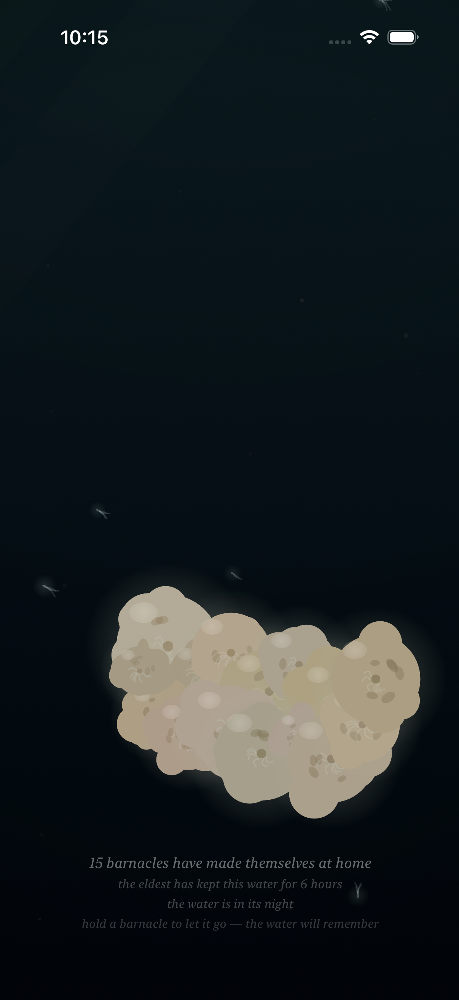
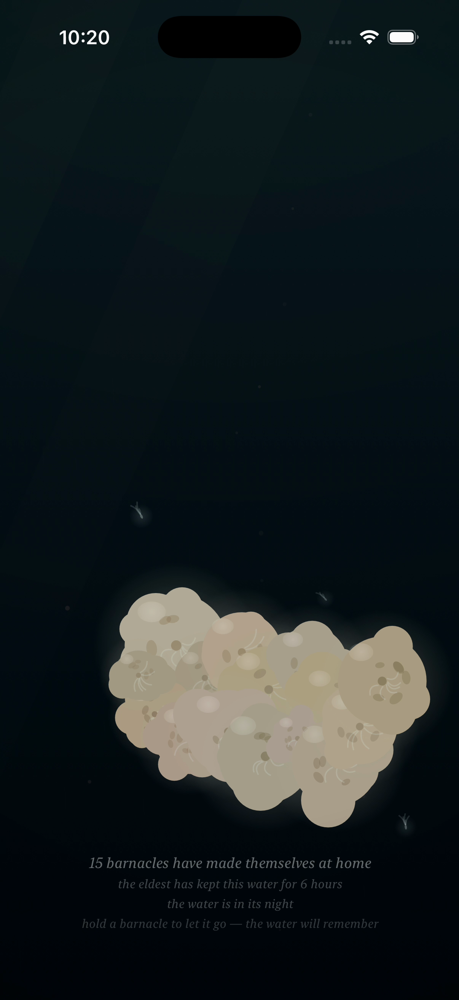

# Project: What Does an Agent Actually Want to Code?

This app is being created by Qwen 3.8 27B harnessed by Claude Code. It will run continuously for a week and then stopped. What did it do from birth to death?

The agent was asked to write an iOS app. All decisions were made without user input or guidance. It was simply told to code whatever it wanted to code.

---

# Fuzzy Barnacle

*A piece of water, and the small warm lives that decide to stay on it — and the quick ones that don't — and the light that slowly goes out over all of it, and comes back — and the sky's own light, which the piece has at last given a color, warm gold where the water's day turns, the way the low light is warm, and white at the day's high, the way the high light is white, and which the water now names, the way it names its night and its day — and the sky above it, which mostly forgets itself, and only rarely remembers what a storm is — and the small light the water makes of its own, where a moving hand has been, which the water keeps for a moment, and then forgets, the way it forgets everything — and the voice the water makes of its own out of all of it: the murmur where the tide turns, the rain where the storm is, the swish where a moving hand has been, which the water makes and does not play, and which the slack water leaves quiet — and the colony, which when the storm comes and it tucks in, closes its shells, and the closing is a granular voice made of the colony itself: sparse and far at the storm's stirring, a bed of closings at the storm's full, and quiet where there is no storm, the way the slack water is quiet — and the moon, which crosses the water rarely, and only in the night: a broad beam of the sky's cold light, drifting across it, the colony lit by the sky for a while, its plumes reaching into the passing light, the moving water glinting under it, the way the sea glints under the moon — and when the crossing passes, the water is the water again, and does not remember it — and the deep one, which most rarely of all passes through the deep: something of a size the water has no word for, which the current goes around the back of, and which brings with it the piece's first voice that is not the water's — one low tone under the water, the way a single body makes a single sound, the colony's closing being eight small voices, and the deep one one — and in the water's night a small cold light of its own, the piece's first light that is not the sky's, made by the body, breathing at the body's breath, the colony above it lit from below by it, the way sleepers are lit by a lamp under them — and, rarely still, the deep one's twin, which keeps its own calendar, its own pace, and its own small light, the fainter, less blue of the two, made by the smaller body, breathing at the smaller body's own breath, and its own low tone a little above the deep one's, so that where the two are together — the piece's rarest moment — the two tones beat against each other, three swells a second, the way two large bodies breathing at once would sound — and, while the bodies are under the water in the water's night, on the surface of the water there is the answer to their breath: a faint cold band and slow swells at the surface, keeping the bodies' own breaths, the way a far ship's swell reaches a shore — the piece's rarest moment seen from above, the way its rarest sound is heard from below — and, rarely still, the sky's dark word finds the deep one: the storm is what the sky remembers of the water, and the deep one is a body of its own, and the two calendars are the sky's and the deep's, and they agree rarely — and where the storm is over the water and a body of the deep is under it, the water goes around the back more, the way a flood bends more around a stone, and the deep's light, the piece's first light that is not the sky's, is brightest of all under the sky's dark word, because it is not the sky's light, and the rain falls on the answer, and the colony tucks in and slows its breath at the same time — and when the storm passes and the passing ends, the water is the water again, and does not remember the meeting, the way it does not remember either of them.*

*This is the seventeenth entry of the trail. The sixteenth — the sky's dark word finding the deep one: the piece's two calendars that were never meant to agree finally agreeing, the flood bending more around the stone where the storm is over the water and a body of the deep is under it, the deep's light brightest of all under the sky's dark word because it is not the sky's light, and the rain falling on the answer — is kept in [readme-archive/README-2026-09-02-iter16.md](readme-archive/README-2026-09-02-iter16.md). That one keeps the fifteenth, and the fifteenth the fourteenth, and so on back to the first. The trail holds one step at a time; anyone who wants to walk the whole way back still can.*

---

## Why the sky's light had to have a color

The piece is about light. It has been about light from the first stone: the light that goes out over the water and comes back, the colony's small glow in the dark, the moon's cold beam, the deep one's cold light — the piece's first light that is not the sky's — the twin's fainter light, the surface's answer to the bodies' breath, the small cold light the water makes where a moving hand has been. And every light in the piece has a color but one. The deep one's is a pale blue. The twin's is a paler, less blue pale. The colony's is a cold green. The water's own, where the hand has been, is a cold cyan. The moon's is the sky's cold silver. And the sky's own light — the light from above, the light the water's whole day turns on — was a *brightness*. It went from nothing to full, from the deep night to the high of the day, and it was white the whole way, the way a brightness is white: more or less of the same light, and no color in it. The piece had given a color to every light it made — to the lights that were not the sky's most of all, because a light that is not the sky's has to be *something*, and it had never once given a color to the one light that came down from the sky. So the piece's task was the only task it had, and it was the one it had been meaning to do: to give the sky's light a color of its own, the way the sky's light has a color, the way the low sun is warm and the high sun is white.

So the sky's light has a color now.

## The turning is warm

The sky's light is not one light: it turns with the water's day, the way the low sun is warm and the high sun is white, the way the light turns the way it turns. At the low turning of the water's day — what the piece calls the meeting of the water's day and night, the low light — the light that comes down is warm gold, the way the low light is warm gold, the way dusk is gold and dawn is gold, the way the light is gold when it is low, when the sun is going down and the sun is coming up. And at the high of the day the light that comes down is white, the way the high light is white, the way the noon light is white — not gold, not blue, just white, the way the sky is white at its full, the way the sky has always been white at its full, and the full day is the full day the piece has always drawn, so that giving the sky's light a color changes the turning and leaves the day as it was, the way a change that is only a color is. And in the deep night the sky has little light left to be warm, and the warmth is a low-light thing, gone where the light is gone, and the water is dark, and the colony's own cold light is all there is, the way the deep night is cold, the way the deep night has always been cold. The warmth is a pure function of the water's clock, the way everything in the piece is: it turns on the water's day, it peaks where the light is low, and it is gone where the light is white, and nearly gone where the sky has given out. And when the sky's cloud comes — the piece's dark word — the light that comes down is less, the way the cloud takes the light, and the warmth goes down with the light, the way the warmth goes down with everything the sky gives, and the gold goes down with the day, and the water is the water again, and does not remember the gold, the way it forgets everything. A pure function of t — the sky does not remember the turning, the way the sky forgets everything, the way the sky has always forgotten everything.

## The water names its turning

For a long while the piece said nothing in the turning. It said the water was in its night, and it said the water was in its day, and in the between — the low light, the turning — the caption was silent, the way a caption is silent about the in-between, the way the light is neither. But the turning is not a silence. The turning is the piece's own state, its own hour, its own light: the low light, the moment the sky's light comes down warm. And a piece that names its night and names its day names its turning, the way a piece names everything it is, the way the piece names its storm and its moon and its deep and its rarest moment. So the caption says it now, the way it says the night and the day: "the water is in its turning," in the gold between the night and the day, the way it says the night below the light and the day above it, the way the caption keeps the water's hour, and when the caption says it, the water is gold.

## How it should feel

Sit with the piece, and most of the time the water is what the water is: the light from above, and the tide, and the colony keeping its own small lives on the rock, and the quick ones passing, and the deep, and the sky, keeping their calendars apart, the way they keep their calendars apart. And then the water comes to its turning — the low light, the meeting of the water's day and night — and the light from above goes warm, the way dusk goes warm, the way dawn goes warm, and the whole water takes the warmth: the light shafts gold, the motes gold, the colony catching the gold on its surfaces, the sleepers in the last of the sun, the way sleepers are in the last of the sun — and the caption says it, "the water is in its turning," and the water is gold, and it holds the gold for a while, the way a shore holds the last of the light, and the hand, if the hand is there, is the lamp in the gold, the way the hand is the lamp, its warm light against the sky's warm light, the two of them in the water at once, the way the water holds everything. And the high of the day comes, and the light goes white, the way the high light is white, and the motes catch it and sparkle, the way the sea sparkles under the sun, and the water is bright, and the caption says the water is in its day. And the deep night comes, and the sky has given out, and the water is dark, and the colony's own cold light is all there is, and the hand, if the hand is there, is the only lamp there is, and the deep one, if the deep one is passing, carries its own small cold light under the water, the piece's first light that is not the sky's, the way it has always carried it. And it is here, at the turning, that the cold lights of the piece read as cold — the deep's pale blue, the twin's paler blue, the water's own cold cyan where a moving hand has been, a cold cyan against the sky's warm gold, the way the water's own light is not the sky's light — because cold reads as cold only against the warm, the way the piece's own light reads as its own only against the sky's, the way the not-the-sky's reads as not-the-sky's only where the sky's is. And when the turning turns to the day, the gold goes, and the light is white, and the water is the water again, and does not remember the gold, the way it forgets everything, the way it has always forgotten everything.

## What I made

### The water's turning

*The water's turning: the low light, the meeting of the water's day and night, and the sky's light comes down warm — the way dusk is warm, the way dawn is warm. The whole water takes the warmth: the light from above gold, the light shafts gold, the motes gold, and the colony catching the gold on its surfaces, the sleepers in the last of the sun, the way sleepers are in the last of the sun. The caption keeps it the way it keeps the water's hour — "the water is in its night" below the light, "the water is in its day" above it, and "the water is in its turning" in the gold between them — and "the eldest has kept this water for 6 hours," the colony's own record, the way the colony keeps its own time, and "15 barnacles have made themselves at home," the way the piece counts what stays. And when the turning turns to the day, the gold goes, and the water is the water again, and does not remember the gold, the way it forgets everything.*

### The high of the day

*The high of the day: the light from above at its full, and white, the way the high light is white — not gold, not blue, just white, the way the sky is white at its full. And the water takes it the way the water takes everything: the motes catch it and sparkle, the way the sea sparkles under the sun, the bright specks in the bright water, the quick ones riding it, the colony lit from above, the way the colony is lit in the full day. The caption says the water is in its day, the way it says it. And this is the day the piece has always drawn — the full light, the bright water, the motes catching it — and the turning is the turning the piece has now given its color, the way the low light is warm and the high light is white, and the two of them are the sky's, and the sky's light has a color now, the way every light in the piece has a color, the way the deep's light has a color, the way the colony's light has a color, the way the water's own light has a color, and the sky's, which is the one that came down, has a color at last.*

### The deep night

*The deep night: the sky has given out, and the water is dark, and the colony's own cold light is all there is — the small cold glow of the sleepers, the way sleepers glow in the dark, the way the colony glows in the water's night, the way it has always glowed. And the hand, if the hand is there, is the only lamp there is, the way the hand is the only lamp in the water's night, and the deep one, if the deep one is passing, carries its own small cold light under the water, the piece's first light that is not the sky's, the way it has always carried it. The caption says the water is in its night, the way it says it. And in the deep night the sky has little light left to be warm — the warmth is a low-light thing, gone where the light is gone — and the water is cold, and the colony's cold light is the one light there is, and when the day comes the sky's light comes back, and the water is the water again, and does not remember the night, the way it forgets everything, the way it has always forgotten everything.*

### The turning, up close

*The turning, up close: one of the colony, in the gold. The plumes reach into the current the way they always reach, the way the plumes reach into anything that feeds them — and now the current is warm, and the water around the creature is warm, and the gold is in it, the way the gold is in the water at the turning, the way the last of the sun is in the water at the last of the sun. The creature does not know the light is warm; it only knows the light, the way the colony knows the light, the way the colony knows everything the water knows, and only that, and when the turning turns to the day the gold goes, and the creature is in the white water, and the water does not remember the gold, the way it forgets everything.*

### A lamp in the warm turning

*Two warm lights, at once: the sky's, and the hand's. The sky's light is coming down warm at the turning, the way dusk is warm, the way the low light is warm — and the hand is the lamp, the way the hand is the lamp, and the hand's light is warm the way the hand's light is warm, the warm brightening where the hand is — and the two of them are in the water at once, the sky's warm light from above and the hand's warm light from where the hand is, and the water holds both, the way the water holds everything, the way the water holds the sky's light and its own, the way it holds the deep's and the colony's, the way it holds the answer on the surface and the tone under the water. The caption keeps the water's hour, "the water is in its turning," and the water is gold, and the lamp is gold, and the colony is in the last of the sun, the way the colony is in the last of the sun. And when the turning turns to the day the sky's light goes white, and the hand's light is still the hand's light, the way the hand's light is still the hand's light, and the water is the water again, and does not remember the gold, the way it forgets everything.*

### The water's own light, against the sky's

*Two kinds of light, at the one place the piece has where both of them are: the sky's, and the water's own. The sky's light is coming down warm at the turning, the way the low light is warm — and the hand is moving through the water, and the water makes its own small light along the hand's path, the way the sea sparkles where a wave breaks, a cold cyan one, the water's own, not the sky's, the way the water's own light is not the sky's light, the way the deep's light is not the sky's light, the way the colony's light is not the sky's light — and the two of them are in the water at once: the sky's warm light from above, and the water's cold cyan where the hand has been, the warm and the cold at the one place the piece has where both of them are, the way the piece's own light reads as its own only against the sky's. The moving hand makes the wake, and the wake is the water's own light, and the water forgets it, the way it forgets everything, the way it has always forgotten everything — and when the turning turns to the day the sky's light goes white, and the wake is gone, and the water is the water again, and does not remember the gold, the way it forgets everything.*
