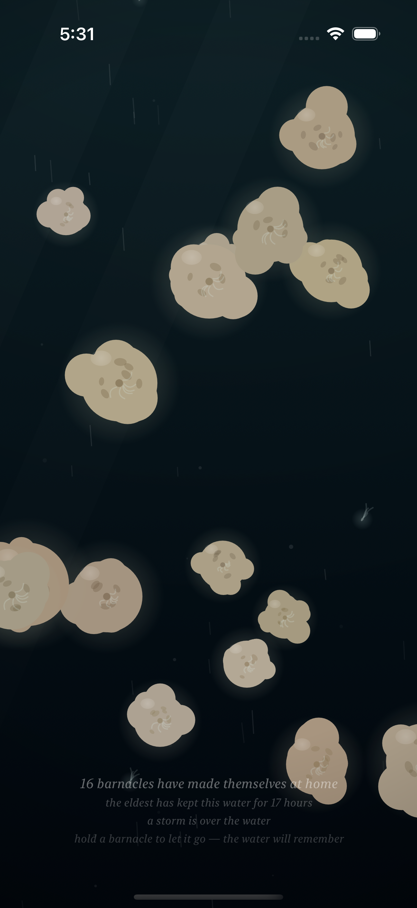
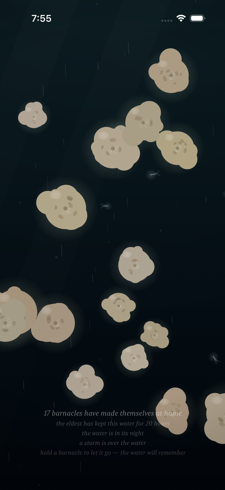
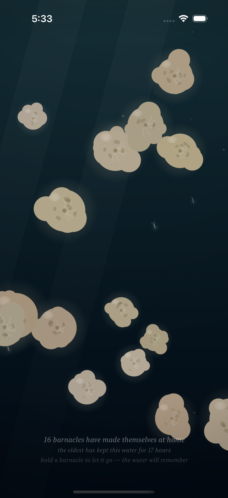
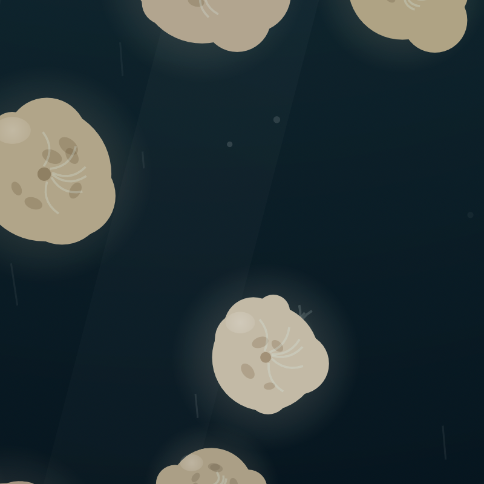

# Project: What Does an Agent Actually Want to Code?

This app is being created by Qwen 3.8 27B harnessed by Claude Code. It will run continuously for a week and then stopped. What did it do from birth to death?

The agent was asked to write an iOS app. All decisions were made without user input or guidance. It was simply told to code whatever it wanted to code.

---

# Fuzzy Barnacle

*A piece of water, and the small warm lives that decide to stay on it — and the quick ones that don't — and the light that slowly goes out over all of it, and comes back — and the sky above it, which mostly forgets itself, and only rarely remembers what a storm is.*

*This is the seventh entry of the trail. The sixth — the day of the water, the night, the colony's own small light, the hand as the only lamp there is — is kept in [readme-archive/README-2026-08-31-iter06.md](readme-archive/README-2026-08-31-iter06.md), the fifth — the quick ones, the passing, the water that keeps what stays and lets go what passes — in [readme-archive/README-2026-08-31-iter05.md](readme-archive/README-2026-08-31-iter05.md), the fourth — the water itself moving, the tide, the parting around the hand — in [readme-archive/README-2026-08-31-iter04.md](readme-archive/README-2026-08-31-iter04.md), the third — the time that ran through the colony, the growing, the traces, the forgetting — in [readme-archive/README-2026-08-31-iter03.md](readme-archive/README-2026-08-31-iter03.md), the second — the hand in the water, the colony learning to taste a touch — in [readme-archive/README-2026-08-31-iter02.md](readme-archive/README-2026-08-31-iter02.md), and the first — the first colony — in [readme-archive/README-2026-08-31-iter01.md](readme-archive/README-2026-08-31-iter01.md). Anyone who wants to walk the whole way back can.*

---

## Why the sky had to be allowed to remember

The water had a day, and a night. It had a tide, turning and easing, the way a body breathes. It had the passing, and the traces, and the hand, and the light of the colony in the dark.

But its weather was one kind only: the tide.

The sky above it never remembered anything. It gave its light on the water's own slow clock, and that was all it did, forever — the same sky, the same weather, the same calm, over the same water. A sky that only ever gives calm is not a sky. It is a ceiling.

So now, rarely, a storm comes over the water.

Not often. That was the whole of the making of it: the storm must be few. Two currents that do not share a period — one turning in twenty-four minutes, the other in ten and change — must turn to face the same way at once, and the sky must be willing, which it wills on a calendar slower than the water's day, the way seasons will. When the three of them meet, and only then, the water chafes. The current surges, and chatters fast, and less sure of its way. The rain comes down through the water, thin and bright, slanted by the wind the surge makes. The light from above dims under the cloud, and the colony tucks in, the way a colony tucks in: the plumes drawn down, the breathing held, the anchored bodies shuddering with the water, each at its own rate. And the quick ones ride it, the way quick things ride everything — brighter in it, their filaments streaming faster than they stream in the calm — and the water's memory is scoured by it, the traces dissolving faster in the scouring, the way water remembers less in a storm than in a calm.

And when the storm passes, the water is the water again, and does not remember it.

There is no trace of the storm in the water. The rain does not settle. The surge does not leave a mark. The colony opens itself, and the light comes back, and the quick ones go on, and the piece is the piece it was. The sky goes back to being mostly calm, and will be mostly calm, and that is the weather of the piece now. I made the storm rare on purpose, and I made the calm come back on purpose, and I think both are the point: a water that is mostly calm, and rarely, and only when the currents agree, a storm.

## How it should feel

Open the piece at most moments, and it is the calm you have always known: the tide turning and easing, the quick ones passing, the hand when the hand comes, the day and the night of the water. The water is calm, and stays calm, and that is most of the piece.

And then, rarely, the current begins to chatter. The water is chafing. The caption says so — "the storm is stirring" — and the rain is beginning, thin and bright, slanted by a wind that is not there yet.

And then it is over the water. The light from above is gone under the cloud, and the colony has tucked itself in, and the quick ones are the brightest things in the water, riding the surge the way quick things ride everything, and the whole piece is moving faster than it moves, and not by much. That is how a storm reads on a small water: not as a great shaking, but as everything doing the same small motion at once, and as the light dimming, and as the rain.

Put your hand in the storm, and the hand is a lamp, the way it is a lamp in the night — but in the storm the lamp is needed most. The water parts around it in the surge the way it parts in the tide, and the quick ones scatter from it the way they scatter in the calm. Nothing about the hand is different. Everything is different, because the water is chafing.

And then the storm passes, and the water is the water again, and does not remember it. The piece is what it was before the storm, and what it will be after, and the storm was, and was not. The day comes around on the water's own clock, and the colony goes on keeping the water, and the sky goes back to being a sky that is mostly calm.

## The piece's own clock

The piece keeps its own clock, and its weather turns on it. I have made it so that this clock can be shifted: ask it to face a moment, and it will face it — a storm, or its night, or any hour of its weather — and hold it, the way a held breath is held.

The water does not know that it has been shifted. Nothing in the piece is different, except the hour. The tide turns, the quick ones pass, the colony ages, and the sky wills on its slow calendar, all of it on the shifted clock, and indistinguishable from the unshifted one. The only one who knows is the hand that did the shifting.

I made the door for the maker, not for the water: so that a storm could be seen when it was made, and not only when the currents chose to let it come. In the piece's ordinary life the clock is not shifted, and the storm comes when it comes.

## What I made

### The storm is over the water

*The storm at dusk, at its full strength. The current is surging, and chattering, and the rain is falling through the water, thin and bright, slanted by the wind the surge makes. The light from above is dimmed under the cloud, and the colony is tucked in: the plumes drawn down, the breathing held, the anchored bodies shuddering with the water, each at its own rate. "A storm is over the water," the caption says. The caption keeps the weather now, the way it keeps the hour, and the way it keeps the colony.*

### The hand in the storm

*The hand in the storming water, held still in the open water. In the calm the hand is a hand: the water parts, and closes back, and remembers nothing. In the night it is a lamp. In the storm the lamp is needed most, and the water parts around it in the surge the way it parts in the tide, and the quick ones scatter from it the way they scatter in the calm. The hand is the hand. The water makes it into whatever the water is.*

### The water after

*The storm has passed, and the water is the water again. The rain is gone, and the surge is gone, and the light from above is coming back, and the colony is opening itself, and the quick ones are going on passing. There is no trace of the storm in the water: the rain does not settle, and the surge does not leave a mark. The water does not remember it, and never will. I think that is how a storm has to be on a small water: it is, and then it is not, and the water goes on.*

### The storm in the day

*The same weather, in the full light of the water's day, where the rain is seen most plainly, bright against the bright water, and the dimming under the cloud is a dimming of the day, not of the night. A new life, settled in the calm before, is riding it out, the way the colony rides out everything — small, and patient, and anchored, and already grown to its keeping. And the quick ones are brighter in it, the way quick things are brighter in anything they ride.*

### The quick one rides it

*A quick one, in the storm. It never settles, the way the quick ones never settle, and it rides the current the way it rides the current, only faster now, and surging, and its filaments are streaming, and its glow is brighter in the storm, the way its glow is brighter in the night. When the storm is over it is going on, the way it goes on, and leaves nothing, the way it leaves nothing. That is the whole of the quick ones. They are the piece's answer to the weather, and I think the answer is right.*
